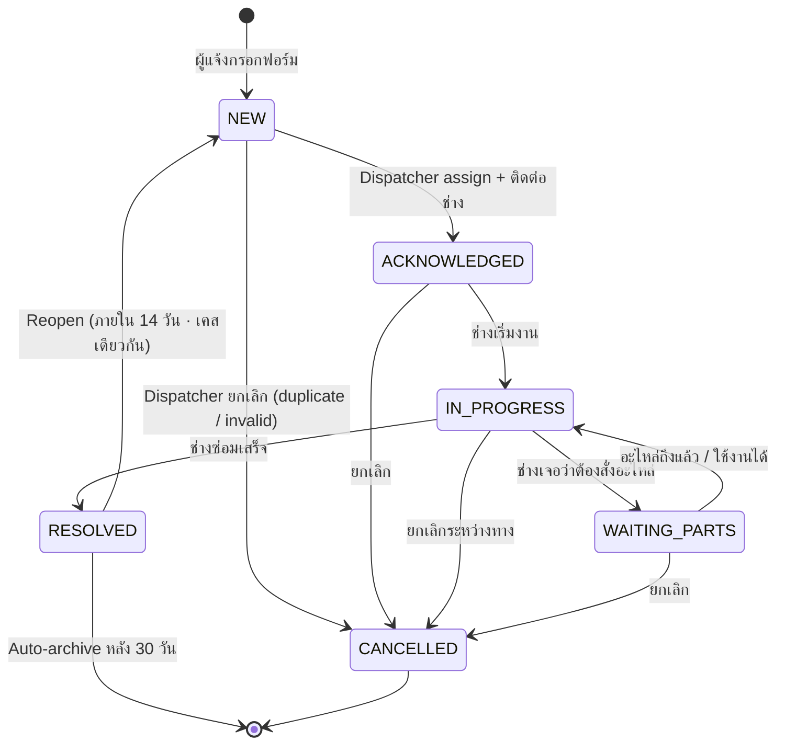

# REPAIR_PLAN.md — โปรแกรม "ระบบแจ้งซ่อม Pooil" (PooilFix)

> **สถานะ:** PLAN ONLY · ยังไม่เริ่มเขียน code
> **สร้าง:** 2026-05-20 · CEO สั่ง spin-up war-room 8 เสียง · พร้อมอ้างอิง mockup จาก auditmekub artifact
> **Owner:** Pattipan (CEO/Founder, JP Sync Group)
> **สังกัด:** Pooilgroup (`pooilgroup/legacy/pooilgroup-web/`) · เพิ่มเป็น module ใหม่
> **Footprint:** ไม่แตะ module เดิม (CashHub / DocuFlow / FuelOS / Recruit) · ใช้ Prisma + RLS + AuditLog + R2 + Resend ของ Pooil ตามเดิม
> **Working brand name (3 ตัวเลือก · CEO เลือก):** **PooilFix** (สั้น จำง่าย) · **Pooil Repair Hub** (ทางการ) · **MaintenoMatch** (cute) — default ในแผนนี้ใช้ "PooilFix"

---

## 🎯 Executive Summary

ทุกวันนี้ Pooil + JPSync แจ้งซ่อมผ่าน **LINE group + กระดาษ + Excel** · เรื่องตกหล่นเยอะ · ไม่มีใครรู้ว่า "ตู้คีบสาขา 12 พังตั้งแต่เมื่อไหร่" · ช่างไม่รู้คิวงาน · จัดซื้อไม่รู้ว่าต้องเตรียมอะไหล่อะไร · CEO อยากเห็นภาพรวมแล้วเรื่องราวก็จมหายในแชต

โปรแกรม **PooilFix** = ระบบแจ้งซ่อมที่ "ใครก็แจ้งได้ · ช่างเห็นแต่งานตัวเอง · จัดซื้อเห็นภาพอะไหล่รวม · CEO เห็นค่าใช้จ่าย"

**Core value proposition (CEO language):**
1. **ใครก็แจ้งได้ใน 30 วินาที** — เปิดลิ้งค์ → ถ่ายรูป → กรอกชื่อ+เบอร์ → ส่ง · ไม่ต้อง login
2. **เลขที่ใบเฉพาะ** (RP-2569-014) — เก็บไว้ติดตามได้ตลอด · เปิดอีกครั้งทีหลังก็เจอ
3. **ช่างเห็นแค่งานของตัวเอง** — รวมทั้งช่างใน บริษัทและช่างนอก (vendor)
4. **จัดซื้อเห็นภาพอะไหล่ข้ามใบ** — "เราต้องซื้อ capacitor 35µF จำนวน 3 ตัวสัปดาห์นี้"
5. **CEO เห็นค่าซ่อมรวมเดือนนี้ + งานค้าง + งานด่วน** — บน dashboard เดียว
6. **ทุกเรื่องมีหลักฐาน** — รูปก่อน/ระหว่าง/หลัง · timeline ทุก status change · ใครทำอะไรเมื่อไหร่

**Estimated:** 8-10 วันทำงาน (2-2.5 อาทิตย์) · 7 ตารางใหม่ · 1 module ใหม่ · ไม่กระทบ module เดิม

**Inspiration UI:** Mockup `Repairs.html` ของ AuditMe (List+Detail · Detail expanded · Kanban) — เป็น visual north star · ปรับให้เป็น context Pooil (ปั๊ม/คลัง/ออฟฟิศ · ไม่ใช่ห้องโรงแรม)

---

## 📋 Round 2 Decisions (2026-05-20 · CEO ตอบ open questions)

CEO ตอบ open questions รอบแรก 4 ข้อชัด · 3 ข้อ default · 2 ข้อยังกำกวม:

| Topic | CEO answer (verbatim) | Decision | Impact |
|---|---|---|---|
| **🎯 Standalone product** | "แยกมาโปรแกรม โดดก่อนเลย" | PooilFix shell แยก = own URL `/repair/*` · own branding · own login page (vendor + reporter) · **ไม่ embed ใน admin nav** ของ Pooil · same Vercel deploy + same Supabase ตาม [[architecture-c-separate-deploy-share-auth]] · ถ้า CEO หมายถึง Vercel project ใหม่จริง ๆ → ต้องถามรอบหน้า | UI shell ใหม่ทั้งหมด · ไม่ใช้ Pooil admin layout · marketing-style landing สำหรับ `/repair` · บอกชัดว่าเป็น "PooilFix" product |
| **Q2 OTP vendor** | "vendor หรอ line ได้" | **LINE Notify เป็น primary** สำหรับ vendor tech · admin อ่าน OTP ปากเปล่าเป็น fallback · SMS defer ไม่ใช้ใน MVP | ต้อง setup LINE Notify token + flow · ตัด SMS cost · vendor ต้องมี LINE (สมเหตุสมผลในไทย) |
| **Q3 Reopen window** | "เอาจนadmin มาปิด" | **ไม่มี auto-close · ไม่มี time window** · ใบที่ RESOLVED แล้วเปิดใหม่ได้เสมอจนกว่า admin จะกด "ปิดถาวร" (CLOSED state) | เอา reopen-timer ออกจาก schema · เพิ่ม `CLOSED` state ใน enum (admin-only transition) · UI: ใบ RESOLVED มีปุ่ม "เปิดใหม่" + admin มีปุ่ม "ปิดถาวร" |
| **Q6 Photo handling** | "ย่อให้เล็ก ไฟล์ไม่ต้องชัด เก็บสักพักแล้วลบ · before/after + เก็บค่าพวกบิลใบเสร็จ ถ้ามี" | **Client compress aggressively:** target ~150-250KB · WebP · max 1024px edge · quality 65% · **R2 lifecycle: 90 วันลบอัตโนมัติ** (ยกเว้น receipt/invoice → 1 ปี) · **photo type ใหม่: `RECEIPT`** (บิล/ใบเสร็จ) เพิ่มใน enum (ก่อนหน้านี้มีแค่ BEFORE/DURING/AFTER/PART) | RepairPhoto.phase enum เพิ่ม RECEIPT · R2 lifecycle rule ต่อ prefix · ค่าจัดเก็บถูกมาก (~$0.50/mo สำหรับ 100 ใบ/เดือน) |
| **Q7+Q8 SLA + multi-business** | "78 wfh ได้" | ตีความ = รับ default + mobile-first สำคัญ · **SLA 4hr/24hr/72hr** ต่อ urgency · **Pooil + JPSync ทั้งสอง MVP** · PWA install banner P6 | ไม่ block · UI ต้อง mobile-first จริงจัง (เพราะ vendor ใช้มือถือ + reporter ก็มือถือ) |
| **Q9 AI assist** | "ใช้แค่น้อย เรียกใช้เอา อย่าเปลือง" | **AI ทุกฟีเจอร์ manual trigger** เท่านั้น (ตรงกับ [[ceo-prefers-manual-ai-triggers]]) · P7 ทั้งหมด defer · ถ้าทำ AI ก็เป็นปุ่ม "ช่วยจัด category" / "ช่วยสรุปงาน" · ห้าม auto run | cost cap ~$5-15/mo · ใช้ Gemini Flash 2.5 (ถูกสุด · ตรง stack [[ceo-prefers-manual-ai-triggers]]) |

### ❓ ยังต้องการคำตอบ CEO (2 ข้อ · ผม default แล้วลุย ถ้าผิดบอก)

| # | Default | เหตุผล |
|---|---|---|
| **Q1 Brand name** | **"PooilFix"** | สั้น 7 ตัวอักษร · จำง่าย · CEO เคยเห็นชื่อแล้วไม่ปฏิเสธ · ขอ confirm รอบหน้า |
| **Q4 Customer impact** | free-text only ใน MVP · ไม่ link เข้า FuelOS pump/branch entity · P-later เพิ่ม optional JSON ref | CEO บอก "ไม่เก็บค่าใช้จ่ายขนาดนั้น" → ไม่อยากซับซ้อน |
| **Q5 Public form spam** | rate limit 3 ใบ/IP/ชม + honeypot field + invisible Cloudflare Turnstile · ไม่ใช้ CAPTCHA แสดงให้ user เห็น | Pooil ใช้ Cloudflare อยู่แล้ว · Turnstile ฟรี · ไม่กระทบ UX |

### 💡 Net effect หลัง Round 2

- **Scope ชัดขึ้น** · cost คาดการณ์ < $20/mo (R2 + LINE Notify + AI light)
- **Timeline เท่าเดิม** 8-10 วัน · แต่ P0-P6 อย่างเดียว · P7 (AI) defer ทั้งหมด
- **Schema changes ก่อนเริ่ม P0:**
  1. `RepairPhotoType` enum: เพิ่ม `RECEIPT`
  2. `RepairTicketStatus` enum: เพิ่ม `CLOSED` (admin-only)
  3. ตัด `reopenWindowDays` column ออก
  4. เพิ่ม `closedAt`, `closedById` ใน RepairTicket
- **UI shell ใหม่:** standalone landing `/repair` + reporter login `/repair/login` + vendor login `/repair/vendor` + admin entry `/repair/admin` — แยกจาก Pooil admin shell ทั้งหมด

---

## 🎤 War-Room — 8 เสียง

### 👑 1. Owner / CEO (Pattipan)

**มุมมอง:**
- ตอนนี้เรื่องตกหล่นใน LINE · ช่างซ่อมเสร็จแล้วใครรู้ก็ไม่บอก · พังซ้ำก็ไม่มีคนจำได้
- กลัวสุด = **ไม่มีหลักฐาน** ใครพังตอนไหน ค่าเท่าไหร่ ช่างคนไหนทำ · ปีหน้าตรวจสอบไม่ได้
- ความสำเร็จ = **3 เดือนแรก** ลดเวลาเฉลี่ยจาก "แจ้ง → ซ่อมเสร็จ" ได้ 30% · ลดงานพังซ้ำ 40% (เพราะมี history)
- ห้ามทำให้พนักงานหน้าร้านต้องเรียนรู้ระบบใหม่ยาก · เปิดลิ้งค์แล้วใช้ได้เลย

**3 must-have จาก Owner:**
1. **คนแจ้งไม่ต้อง login** · แค่ถ่ายรูป กรอกชื่อ+เบอร์ ส่ง
2. **CEO dashboard 1 หน้า** ครอบทั้ง Pooil + JPSync · งานเปิด/ด่วน/รออะไหล่/ค่าใช้จ่ายเดือน
3. **Audit trail ครบ** ทุก action มี user + timestamp · export เป็น CSV ได้

---

### 🏢 2. Business Domain Expert (SME Thai Facility Management)

**Context จากตลาดจริง:**
- SME ไทย 95% ใช้ LINE group + ปากเปล่า · ไม่มีระบบ ticketing
- ปัญหา top 5 ของ Pooil/JPSync (จาก context):
  1. **ปั๊มน้ำมัน** — ตู้จ่ายค้าง · POS hang · อ่านมิเตอร์ผิด · หลังคา leak · ไฟดับ
  2. **โรงแรม** — แอร์ไม่เย็น · น้ำไหลช้า · TV ไม่ติด · กลอนประตูเสีย
  3. **7-11 / Café (sub-tenant)** — ตู้เย็น/แช่แข็งร้อน · เครื่องชงพัง · POS hang
  4. **ตู้คีบ / massage chair** — เหรียญติด · เครื่องค้าง · ของในตู้หมด
  5. **คลัง / ออฟฟิศ** — แอร์ · อินเตอร์เน็ต · ไฟฟ้า · ประตู
- เวลาซ่อมเฉลี่ยปัจจุบัน: **3-7 วัน** จากแจ้ง → เสร็จ (เพราะคนแจ้ง→ลืม→ตามไม่ได้)
- ต้นทุนของ "การไม่แจ้ง" = ตู้จ่ายปั๊มเสีย 1 ปั๊ม 1 วัน ≈ ขาดรายได้ 30,000-80,000 บาท
- **ช่างนอกตลาด** ไทย 80% ไม่มีอีเมล · มีแค่เบอร์ LINE · ใช้ส่ง bill เป็นรูป

**3 คำเตือนจาก Business:**
1. ห้ามให้คนแจ้งกรอก field เยอะกว่า 5-6 ช่อง · มือถือพนักงาน Android ราคา 3,000 บาท · กรอกยากจะไม่ใช้
2. รูปต้อง upload ได้แม้สัญญาณอ่อน · มี progress bar + retry + compress ก่อนส่ง
3. ช่างนอกต้องไม่ต้องสมัครเต็มรูปแบบ · ส่ง URL + รหัสรหัสผ่าน OTP ก็พอ

---

### 📊 3. Business Analyst (BA) — User Stories

**Persona 1: ผู้แจ้ง (Reporter · พนักงานหน้าร้าน / ลูกค้า)**

- US-1.1: ฉันต้องการเปิดลิ้งค์บนมือถือ → ถ่ายรูปจุดที่พัง → กรอกชื่อ+เบอร์ → ส่ง · จบใน 30 วินาที
- US-1.2: ฉันต้องการเลือกสาขาแบบ "บริษัท → สาขา → จุด/ห้อง" (guided form) ถ้าฉันเป็นพนักงาน
- US-1.3: ฉันต้องการกรอกแบบ "อิสระ" (free-form) ถ้าฉันเป็นลูกค้าทั่วไป · ไม่รู้รหัสสาขา
- US-1.4: ฉันต้องการได้รับ **เลขที่ใบ (RP-2569-014)** ทันที + ลิ้งค์ติดตาม
- US-1.5: ฉันต้องการดูสถานะภายหลังโดยเปิดลิ้งค์เดิม
- US-1.6: ฉันต้องการสร้างบัญชี (เบอร์โทร + OTP หรือ username+password) เพื่อดูใบของฉันทั้งหมด
- US-1.7: ฉันต้องการ "comment" ในใบเดิมเพิ่มเติม (ลืมบอกอะไรไป)
- US-1.8: ฉันต้องการได้ notification เมื่อสถานะเปลี่ยน (LINE หรือ SMS หรือ email อย่างใดอย่างหนึ่ง)

**Persona 2: หัวหน้าแจ้งซ่อม / Dispatcher (Repair Lead)**

- US-2.1: ฉันต้องการเห็น inbox ใบใหม่ทั้งหมดของสาขาที่อยู่ในความรับผิดชอบ
- US-2.2: ฉันต้องการ assign ใบให้ช่าง (ภายในหรือภายนอก) ด้วย 1 คลิก
- US-2.3: ฉันต้องการเปลี่ยน status ใบ + ใส่ note ได้
- US-2.4: ฉันต้องการตั้งค่า urgency (ด่วนมาก/ปานกลาง/ไม่เร่งด่วน) → ระบบเตือนช่างทันที
- US-2.5: ฉันต้องการเห็น Kanban board ทุก ticket ใน scope
- US-2.6: ฉันต้องการ filter งานด้วย สาขา · ประเภทปัญหา · urgency · ช่าง
- US-2.7: ฉันต้องการดู ETA ของแต่ละใบ + alert เมื่อ overdue
- US-2.8: ฉันต้องการ export รายงานเดือน (CSV/PDF)
- US-2.9: ฉันต้องการเห็นว่าจุดไหนพังซ้ำบ่อย (top 5 recurring issues)
- US-2.10: ฉันต้องการ bulk-assign 5-10 ใบให้ช่างคนเดียวพร้อมกัน

**Persona 3: ช่างซ่อมภายใน (Internal Tech · เป็น Pooil user มี role)**

- US-3.1: ฉันต้องการเห็นเฉพาะงานที่ assign ให้ฉันเท่านั้น (ไม่เห็นของคนอื่น)
- US-3.2: ฉันต้องการเปลี่ยนสถานะงาน (ติดต่อแล้ว → กำลังซ่อม → รออะไหล่ → เสร็จ) ด้วยปุ่มเดียว
- US-3.3: ฉันต้องการ upload รูป "ก่อน-ระหว่าง-หลัง" จากกล้องมือถือตรง ๆ
- US-3.4: ฉันต้องการ add part/อะไหล่ที่ใช้ + ราคา (ถ้ารู้) เข้าใบ
- US-3.5: ฉันต้องการ note + comment ในใบ
- US-3.6: ฉันต้องการเห็น customer impact ("ตู้จ่ายปั๊ม #2 ปิดอยู่") เพื่อจัดลำดับความเร่งด่วน
- US-3.7: ฉันต้องการดู map/นำทางไปที่สาขา (Google Maps deep link)
- US-3.8: ฉันต้องการ acknowledge งาน + ใส่ ETA

**Persona 4: ช่างซ่อมภายนอก / Vendor (Lightweight profile · ไม่ใช่ user เต็ม)**

- US-4.1: ฉันได้รับลิ้งค์ + OTP ทาง SMS/LINE → เปิดแล้วเห็นงานเฉพาะของฉัน
- US-4.2: ฉันไม่ต้องสมัครบัญชีเต็มรูปแบบ · แค่ verify เบอร์ครั้งเดียวต่อ session
- US-4.3: ฉันใช้ feature เหมือนช่างภายในทุกอย่าง (upload รูป · add part · เปลี่ยนสถานะ · note)
- US-4.4: ฉันไม่เห็นข้อมูล internal pricing, ไม่เห็น user list, ไม่เห็นใบของช่างอื่น

**Persona 5: จัดซื้อ (Purchasing)**

- US-5.1: ฉันต้องการเห็น list อะไหล่ที่ "ค้างรอจัดซื้อ" ข้ามทุกใบ (ไม่ใช่ ticket-by-ticket)
- US-5.2: ฉันต้องการ group อะไหล่ตามชื่อ + spec (capacitor 35µF จาก 3 ใบ = ซื้อ 3 ตัวรวด)
- US-5.3: ฉันต้องการ mark "ordered" + ใส่ supplier + วันสั่ง + ราคาจริง
- US-5.4: ฉันต้องการ mark "delivered" + วันที่รับของ → ใบที่เกี่ยวข้องอัปเดตทันที (ช่างเห็นว่าอะไหล่มาแล้ว)
- US-5.5: ฉันต้องการดูประวัติว่าอะไหล่ตัวนี้เคยซื้อจาก supplier ไหน ราคาเท่าไหร่
- US-5.6: ฉันต้องการ export "Purchase Plan" ของสัปดาห์/เดือน ส่งให้บัญชี

**Persona 6: Admin / ผู้ดูแลระบบ**

- US-6.1: ฉันต้องการตั้ง category/sub-category ของปัญหา (แอร์ · ไฟฟ้า · ตู้จ่าย · POS · ...)
- US-6.2: ฉันต้องการเพิ่ม/แก้/ลบช่าง (ภายใน + ภายนอก) · scope per บริษัท
- US-6.3: ฉันต้องการตั้ง SLA per urgency (ด่วนมาก 4 ชม. / ปานกลาง 24 ชม. / ไม่เร่งด่วน 72 ชม.)
- US-6.4: ฉันต้องการดู audit log ทั้งหมดของระบบ

**Persona 7: CEO / Executive**

- US-7.1: ฉันต้องการเห็น dashboard: เปิด/ด่วน/กำลังซ่อม/รออะไหล่/เสร็จเดือนนี้ · ค่าใช้จ่ายรวม
- US-7.2: ฉันต้องการเห็น breakdown ต่อบริษัท · ต่อสาขา · ต่อ category
- US-7.3: ฉันต้องการเห็น top 10 สาขาที่มีปัญหามากสุด
- US-7.4: ฉันต้องการเห็น top 10 อะไหล่ที่ใช้บ่อยที่สุด (เพื่อ stock ล่วงหน้า)
- US-7.5: ฉันต้องการ "drill-down" คลิกตัวเลขแล้วเห็นใบทั้งหมด
- US-7.6: ฉันต้องการ export รายงานรายเดือน เป็น PDF ส่งให้ผู้ถือหุ้น

---

### 🏛 4. Solutions Architect (SA) — Data + State + Permission

**Integration map กับ Pooil ที่มีอยู่:**

| Layer | ใช้ของเดิม | ของใหม่ |
|---|---|---|
| Auth | NextAuth + Supabase Auth ของ Pooil · session ครั้งเดียวข้าม module | + magic-token flow สำหรับ vendor (OTP via SMS) |
| Multi-tenant | `org_id` / `company_id` / `branch_id` claim ใน JWT | + `repair.scope` ใน user_repair_scope table |
| File storage | R2 bucket `pooilgroup` เดิม · prefix `repair/<ticket_id>/<phase>/` (phase = before/during/after/part) | — |
| Email | Resend (template "repair-status-changed") | — |
| LINE notify | ใช้ `lib/line/*` ที่มีอยู่ของ Pooil | template ใหม่ "repair-assigned" + "repair-status-changed" |
| SMS | **ยังไม่มี** ใน Pooil → Phase P6+ (Twilio หรือ Thai SMS provider) · เริ่มต้นใช้ LINE+Email พอ |
| Audit log | ตาราง `audit_logs` เดิม · เพิ่ม events `repair.*` | — |
| AI (optional) | Anthropic SDK ผ่าน `lib/ai/*` เดิม | category-suggester (haiku) · P-later |
| Notifications | Pooil notification table เดิม + bell ใน topbar | — |
| Audit log | ใช้ตาราง `audit_logs` ตามเดิม ทุก action ลง resourceType = `repair.ticket` / `repair.part` / `repair.timeline_event` | — |

**3 คำเตือนจาก SA:**

1. **Public form ห้ามใช้ Prisma adminClient ตรง ๆ** — ใช้ server action ที่ verify slug+status ก่อนเขียน · rate limit per IP + per phone + honeypot
2. **Photo upload ต้อง verify ฝั่ง server** — MIME type whitelist (jpg/png/heic/webp) · max 10MB/file · max 6 files/ticket · ต้อง re-encode/compress ฝั่ง server หรือ enforce ฝั่ง client ก่อนส่ง (ใช้ `browser-image-compression`)
3. **Vendor magic-link token expiry** — token ต้องหมดอายุ 7 วัน · refresh ได้ · ห้าม leak ใน URL log (ใช้ httpOnly cookie หลัง first verify)

---

### 💻 5. Dev / Tech Lead — Implementation

**Tech choices ภายใน Pooil stack:**

- **Framework:** Next.js 15 App Router (เดิม) · Server Components default · Server Actions สำหรับ mutation
- **ORM:** Prisma (เดิม) · เพิ่ม model ใหม่ใน `prisma/schema.prisma` · migration ใหม่
- **UI primitives:** shadcn/ui ของ Pooil (มี Dialog · Sheet · Combobox · DropdownMenu · Toast) — reuse 100%
- **Kanban:** `dnd-kit` (Pooil เริ่มใช้แล้ว ที่ recruit) · หรือ `@dnd-kit/sortable` + `@dnd-kit/core`
- **Multi-pane workspace:** `react-resizable-panels` (pattern จาก RECRUIT_DESIGN_PLAN.md)
- **Forms:** react-hook-form + zod (Pooil ใช้ `@/lib/zod-helpers` `zUUID()` — RULE จาก memory)
- **File upload:** R2 signed URL flow (lib/r2 ของ Pooil) + client-side compression
- **Date/Time:** `dayjs` (Pooil เดิม)
- **Charts:** `recharts` (Pooil เดิม สำหรับ dashboard)
- **Validation:** zod runtime · ห้าม `z.string().uuid()` ใช้ `zUUID()` จาก memory rule

**สิ่งที่ reuse จาก Pooil:**
- `lib/auth/role-guards.ts` — เพิ่ม `REPAIR_ROLES`
- `lib/audit/` — call `logAudit({ action: 'repair.ticket.created', ... })`
- `lib/r2/*` — signed upload + delete + lifecycle
- `lib/notifications/*` — fan-out: email / LINE / in-app bell
- `components/layout/*` — workspace shell · sidebar nav
- `components/ui/*` — button, dialog, sheet, combobox, badge
- `lib/zod-helpers/zUUID` (memory rule: ห้าม `z.string().uuid()` ตรง ๆ)

**สิ่งที่ build ใหม่:**
- `app/(admin)/repair/` — admin shell + page
- `app/repair/` — public intake + tracking
- `app/api/repair/*` — webhook สำหรับ vendor token verify, signed URL endpoints (ถ้าจำเป็น)
- `lib/repair/` — business logic (state machine guard, ticket-id generator, part aggregator, SLA evaluator)
- `components/repair/*` — TicketCard, TicketDetail, KanbanBoard, PhotoUploader, PartTable, Timeline
- `prisma/migrations/<ts>_repair_*` — DB migration

**Testing approach:**
- Playwright e2e ของ Pooil มีอยู่แล้ว → เพิ่ม `tests/repair/*.spec.ts`:
  - Public submission flow (no auth)
  - Vendor magic-link flow
  - Status state machine (ห้ามกระโดด `เสร็จ → เปิด·ใหม่` โดยไม่ผ่าน `reopen` event)
  - Permission boundary (tech A ไม่เห็น ticket ของ tech B)
- Smoke tests ของ Pooil (`tests/smoke/`) → เพิ่ม `repair-health.ts` ที่เช็ค status enum + table

**3 risk จาก Dev:**
1. State machine ซับซ้อนกว่าที่ Recruit (มี 6 status + reopen + cancel) → ต้องเขียน transition matrix + unit test
2. R2 photo upload จาก spotty mobile data ที่ปั๊ม remote → ต้องมี chunk + retry + offline queue (อาจต้อง defer ไว้ P6+)
3. Vendor magic-link ต้องระวัง replay attack → token one-time-use สำหรับ first verify · session cookie หลังจากนั้น

---

### 🔧 6. หัวหน้าแจ้งซ่อม (Head of Repair) — Operational Reality

**สิ่งที่ทำจริงในแต่ละวัน:**
- เช้า 8:00 เปิด LINE group ของ "ซ่อมบำรุง" → สแกนข้อความค้างคืน 50+ ข้อความ → ใส่ลง Excel
- เลือกใบไหนด่วน → call/ส่งช่าง · มักลืมว่ามอบใครไปบ้าง
- ปลายวัน 17:00 → ตรวจว่าใบไหนทำเสร็จ · ใบไหนค้าง · ใบไหนรออะไหล่
- ปลายเดือนแจ้ง CEO ค่าซ่อมรวม · แต่ตัวเลขมักไม่ตรงเพราะ bill ช่างนอกมาช้า

**Dispatch logic ในใจหัวหน้า:**
1. **Urgency มาก่อน** — ด่วนมาก = ทำเดี๋ยวนั้น · ไม่ว่าใครว่าง
2. **Skill match** — แอร์ → ช่างนิว · ไฟฟ้า → ช่างมานพ · POS/อิเล็กฯ → ช่าง Vendor X
3. **Geography** — ราชบุรี ใกล้กับ เพชรบุรี → ใช้ช่างคนเดียวเหมาเป็นรอบ
4. **Workload balance** — ช่างคนเดียวห้ามค้าง > 5 ใบ · เกินจะ assign ใหม่ไม่ได้
5. **Vendor cost** — ช่างนอก = แพง · ใช้เมื่อใน house ทำไม่ได้

**SLA ที่ใช้จริง:**

| Urgency | Response (ติดต่อช่างแล้ว) | Resolution (เสร็จ) |
|---|---|---|
| ด่วนมาก (ตู้จ่ายปั๊มเสีย / ไฟดับ / น้ำท่วม) | 30 นาที | 4 ชั่วโมง |
| ปานกลาง (แอร์ไม่เย็น / POS slow) | 4 ชั่วโมง | 24 ชั่วโมง |
| ไม่เร่งด่วน (cosmetic / preventive) | 24 ชั่วโมง | 72 ชั่วโมง |

**Metrics ที่ Head of Repair อยากเห็น:**
1. **Average time-to-acknowledge** (เปิดใหม่ → ติดต่อช่างแล้ว)
2. **Average time-to-resolve** (เปิดใหม่ → เสร็จ)
3. **SLA breach %** (ต่อ urgency)
4. **Repeat-failure rate** (ใบเดียวกัน reopen ภายใน 14 วัน — สาขาเดียวกัน category เดียวกัน)
5. **Technician load** (กี่ใบ active ต่อช่าง)
6. **Vendor cost ratio** (% ของ ticket ที่ใช้ช่างนอก)

**3 must-have จาก Head of Repair:**
1. **Quick-assign chip** — เห็นรายชื่อช่าง + workload ปัจจุบัน + skill tag → คลิกครั้งเดียวจบ
2. **SLA countdown ในการ์ดทุกใบ** — สีเขียว/เหลือง/แดง · เห็นจากระยะไกล
3. **One-tap reopen** — เสร็จแล้วกลับมาเสีย → reopen ใบเดิม (อย่าให้สร้างใหม่ · จะนับ repeat failure ไม่ได้)

---

### 🛠 7. ช่างซ่อม (Maintenance Tech · ทั้งภายในและภายนอก)

**Reality:**
- ทำงานในสนามตลอดวัน · มือถือเครื่องเดียวเป็นทุกอย่าง · บางที่สัญญาณอ่อนมาก (basement / ห้องเครื่อง)
- มือเปื้อนน้ำมัน · ใช้นิ้วโป้งตอนเดียวพอ
- ไม่อยากอ่านอะไรยาว · ดูรูปกับชื่ออะไหล่พอ
- ภาษาอังกฤษไม่ได้ · เลขก็พิมพ์ช้า · ชอบ dropdown/preset

**Mobile UI requirements (non-negotiable):**
1. **ปุ่ม > 44pt** (iOS HIG / Material spec) · ไม่มี link เล็ก ๆ
2. **One-thumb reachable** — primary action ใน lower half ของจอ
3. **Offline-tolerant** — กดส่งแล้วถ้าเน็ตหลุด queue + retry · ไม่ถามคำถาม
4. **Photo upload = main feature** — กล้องเปิดได้ใน 1 tap · auto-compress
5. **ปุ่ม status เป็น big colored button** — ไม่ใช่ dropdown
6. **Quick-comment templates** — "เริ่มงาน" / "อะไหล่มาแล้ว" / "เสร็จแล้ว — รอ user confirm" / "ต้องรออะไหล่ X วัน" — กดปุ่มเดียว ไม่ต้องพิมพ์

**3 must-have จาก ช่าง:**
1. **Map link to สาขา** + เบอร์ ผจก./คนแจ้ง — กดโทร/นำทางตรง
2. **กล้องเปิดได้ทันที** ไม่ต้องผ่าน 3 หน้าจอ
3. **Voice note** สำหรับ comment (Phase 2 ก็ได้ · แต่ออกแบบเผื่อ)

---

### 🛒 8. จัดซื้อ (Purchasing)

**Reality:**
- ตอนนี้ ทำ Excel "อะไหล่ที่ต้องซื้อ" รายสัปดาห์ · ช่างแจ้งใน LINE → จัดซื้อ copy ลง Excel
- บ่อยครั้งสั่งซ้ำเพราะลืมว่าซื้อไปแล้ว
- ไม่รู้ว่าอะไหล่ตัวไหนใช้บ่อย · ต้อง stock เป็นจำนวนเท่าไหร่
- Supplier มีหลายเจ้า · ราคาต่างกัน · ไม่มีฐานข้อมูล

**Workflow ที่อยากได้:**
1. เปิดหน้า "Purchasing Queue" → เห็นอะไหล่ทุกตัวที่ "needed" รวมกันข้ามทุก ticket
2. Group by part name + spec → เห็นว่า "capacitor 35µF ต้องการรวม 3 ตัว จาก 3 ticket"
3. Mark "ordered" + ใส่ supplier + ราคา + วันคาดส่ง → ticket ที่เกี่ยวข้องอัปเดตเป็น "อะไหล่กำลังมา"
4. Mark "delivered" + วันรับ → ticket อัปเดตเป็น "อะไหล่ถึงแล้ว · พร้อมซ่อม" · ช่างได้ notify
5. ดูประวัติ supplier per part → กรอง "ใช้ supplier A เพราะถูกกว่า"

**3 must-have จาก จัดซื้อ:**
1. **Aggregated view ไม่ใช่ ticket-by-ticket** — รวม part list ข้ามใบ
2. **Supplier directory** — เก็บ supplier + ราคาที่เคยซื้อ + เบอร์ติดต่อ
3. **Ordered/Delivered toggle เชื่อมกลับใบ** — ช่างเห็นทันทีว่าของถึงแล้ว ไม่ต้องโทรถาม

---

## 🤝 ฉันทามติทั้ง 8 เสียง

ทุกคนเห็นพ้อง 10 ข้อนี้ · CEO ไม่ต้องตัดสิน:

1. ✅ Public intake ไม่ต้อง login · เลขใบเฉพาะ (RP-25YY-NNNN) + ลิ้งค์ติดตาม
2. ✅ Status flow 6 states (เปิด·ใหม่ / ติดต่อช่างแล้ว / กำลังซ่อม / รออะไหล่ / เสร็จแล้ว / ยกเลิก) + reopen edge
3. ✅ Urgency 3 levels (ด่วนมาก / ปานกลาง / ไม่เร่งด่วน) + SLA per urgency
4. ✅ ช่างเห็นแค่ ticket ของตัวเอง (RLS strict per `assignedTechId`)
5. ✅ Photo phases = before / during / after / part
6. ✅ Vendor login = magic-link OTP (ไม่ต้องสร้าง user เต็ม)
7. ✅ Audit log ทุก action (resourceType `repair.*`)
8. ✅ Multi-pane workspace pattern (ตาม RECRUIT_DESIGN_PLAN.md ที่ Pooil approve แล้ว)
9. ✅ Cost tracking = light · part + qty + rough cost · ไม่มี accounting entry แยก
10. ✅ Notification fan-out: email (Resend) + LINE (เดิม) + in-app bell · SMS = Phase 2

---

## 🗺 Personas & User Stories (Consolidated)

| ID | Persona | Story |
|---|---|---|
| US-1.1 | Reporter | กรอกใบใน 30 วินาที · public link |
| US-1.2 | Reporter | Guided form (บริษัท → สาขา → category) |
| US-1.3 | Reporter | Free-form (ลูกค้านอก) |
| US-1.4 | Reporter | ได้ ticket number + tracking URL |
| US-1.5 | Reporter | กลับมาดูสถานะภายหลัง |
| US-1.6 | Reporter | สร้าง lightweight account (เบอร์+OTP) |
| US-1.7 | Reporter | Comment เพิ่ม |
| US-1.8 | Reporter | Notification ตอนสถานะเปลี่ยน |
| US-2.1 | Dispatcher | Inbox ของ scope |
| US-2.2 | Dispatcher | Assign ใน 1 click |
| US-2.3 | Dispatcher | Change status + note |
| US-2.4 | Dispatcher | Set urgency |
| US-2.5 | Dispatcher | Kanban view |
| US-2.6 | Dispatcher | Filter (สาขา/category/urgency/ช่าง) |
| US-2.7 | Dispatcher | ETA + overdue alert |
| US-2.8 | Dispatcher | Export CSV/PDF |
| US-2.9 | Dispatcher | Recurring issues report |
| US-2.10 | Dispatcher | Bulk assign |
| US-3.1 | Internal Tech | เห็นแค่งานของตัวเอง |
| US-3.2 | Internal Tech | One-tap status change |
| US-3.3 | Internal Tech | Photo upload before/during/after |
| US-3.4 | Internal Tech | Add part + qty + cost |
| US-3.5 | Internal Tech | Note + comment |
| US-3.6 | Internal Tech | เห็น customer impact |
| US-3.7 | Internal Tech | Map deep-link + tap-to-call |
| US-3.8 | Internal Tech | Acknowledge + set ETA |
| US-4.1 | Vendor Tech | Magic-link + OTP login |
| US-4.2 | Vendor Tech | ไม่ต้องสมัครเต็มรูปแบบ |
| US-4.3 | Vendor Tech | ใช้ feature ทุกอย่างเหมือนช่างใน |
| US-4.4 | Vendor Tech | จำกัด data scope |
| US-5.1 | Purchasing | Cross-ticket parts queue |
| US-5.2 | Purchasing | Group by part name+spec |
| US-5.3 | Purchasing | Mark ordered |
| US-5.4 | Purchasing | Mark delivered → updates ticket |
| US-5.5 | Purchasing | Supplier history per part |
| US-5.6 | Purchasing | Export purchase plan |
| US-6.1 | Admin | Manage categories |
| US-6.2 | Admin | Manage technicians |
| US-6.3 | Admin | Configure SLA |
| US-6.4 | Admin | Audit log viewer |
| US-7.1 | CEO | Dashboard 1-page |
| US-7.2 | CEO | Breakdown ต่อบริษัท/สาขา/category |
| US-7.3 | CEO | Top 10 problem branches |
| US-7.4 | CEO | Top 10 parts used |
| US-7.5 | CEO | Drill-down |
| US-7.6 | CEO | Monthly PDF export |

---

## 🧱 Data Model

### Tables ใหม่ (7 ตัว) — Prisma sketch

```prisma
// =============================================================
// repair_categories — taxonomy (admin-managed)
// =============================================================
model RepairCategory {
  id             String   @id @default(uuid()) @db.Uuid
  orgId          String   @map("org_id") @db.Uuid
  parentId       String?  @map("parent_id") @db.Uuid  // self-FK → sub-category
  code           String   // AC / ELEC / POS / PUMP / ...
  nameTh         String   @map("name_th")
  nameEn         String?  @map("name_en")
  icon           String?  // emoji or lucide icon name
  sortOrder      Int      @default(0) @map("sort_order")
  isActive       Boolean  @default(true) @map("is_active")
  createdAt      DateTime @default(now()) @map("created_at") @db.Timestamptz(6)
  updatedAt      DateTime @updatedAt @map("updated_at") @db.Timestamptz(6)

  org      Organization      @relation(fields: [orgId], references: [id], onDelete: Restrict)
  parent   RepairCategory?   @relation("CategoryTree", fields: [parentId], references: [id], onDelete: SetNull)
  children RepairCategory[]  @relation("CategoryTree")
  tickets  RepairTicket[]

  @@unique([orgId, code])
  @@index([orgId, isActive])
  @@map("repair_categories")
}

// =============================================================
// repair_technicians — internal user OR external vendor profile
// =============================================================
enum TechnicianKind {
  internal  // FK → users
  vendor    // standalone profile, magic-link login
}

model RepairTechnician {
  id              String         @id @default(uuid()) @db.Uuid
  orgId           String         @map("org_id") @db.Uuid
  companyScope    String[]       @map("company_scope")  // ["POOIL"] | ["JPSYNC"] | ["POOIL","JPSYNC"]
  kind            TechnicianKind
  userId          String?        @map("user_id") @db.Uuid     // if kind=internal
  displayName     String         @map("display_name")
  phone           String         // primary identifier
  lineUserId      String?        @map("line_user_id")
  email           String?
  skills          String[]       // category codes ["AC","ELEC"] for skill match
  active          Boolean        @default(true)
  notes           String?
  createdAt       DateTime       @default(now()) @map("created_at") @db.Timestamptz(6)
  updatedAt       DateTime       @updatedAt @map("updated_at") @db.Timestamptz(6)

  org           Organization        @relation(fields: [orgId], references: [id], onDelete: Restrict)
  user          User?               @relation(fields: [userId], references: [id], onDelete: SetNull)
  tickets       RepairTicket[]
  vendorTokens  VendorAuthToken[]

  @@unique([orgId, phone])
  @@index([orgId, active])
  @@index([userId])
  @@map("repair_technicians")
}

// =============================================================
// repair_tickets — main entity
// =============================================================
enum RepairStatus {
  NEW              // เปิด·ใหม่
  ACKNOWLEDGED     // ติดต่อช่างแล้ว
  IN_PROGRESS      // กำลังซ่อม
  WAITING_PARTS    // รออะไหล่
  RESOLVED         // เสร็จแล้ว
  CANCELLED        // ยกเลิก
}

enum RepairUrgency {
  URGENT     // ด่วนมาก
  MEDIUM     // ปานกลาง
  LOW        // ไม่เร่งด่วน
}

enum IntakeType {
  GUIDED     // พนักงานเลือกสาขา + category
  FREEFORM   // กรอกอิสระ ไม่รู้สาขา
}

model RepairTicket {
  id              String           @id @default(uuid()) @db.Uuid
  orgId           String           @map("org_id") @db.Uuid
  companyId       String?          @map("company_id") @db.Uuid   // null สำหรับ freeform ก่อน triage
  branchId        String?          @map("branch_id") @db.Uuid    // null = unassigned/freeform
  categoryId      String?          @map("category_id") @db.Uuid
  ticketCode      String           @unique @map("ticket_code")    // RP-2569-014
  title           String
  description     String           @db.Text
  intakeType      IntakeType       @map("intake_type")
  status          RepairStatus     @default(NEW)
  urgency         RepairUrgency    @default(MEDIUM)
  // Reporter (may be anon)
  reporterName    String           @map("reporter_name")
  reporterPhone   String           @map("reporter_phone")
  reporterEmail   String?          @map("reporter_email")
  reporterUserId  String?          @map("reporter_user_id") @db.Uuid  // ถ้า login
  locationDetail  String?          @map("location_detail")  // "ห้อง 305" / "ตู้คีบที่ 2" / "ปั๊ม #1"
  customerImpact  String?          @map("customer_impact") @db.Text   // free text + optional ref
  customerImpactRef Json?          @map("customer_impact_ref")  // {type: "fuel_pump", id: "...", note: "..."}
  // Assignment
  assignedTechId  String?          @map("assigned_tech_id") @db.Uuid
  assignedAt      DateTime?        @map("assigned_at") @db.Timestamptz(6)
  acknowledgedAt  DateTime?        @map("acknowledged_at") @db.Timestamptz(6)
  startedAt       DateTime?        @map("started_at") @db.Timestamptz(6)
  resolvedAt      DateTime?        @map("resolved_at") @db.Timestamptz(6)
  cancelledAt     DateTime?        @map("cancelled_at") @db.Timestamptz(6)
  etaAt           DateTime?        @map("eta_at") @db.Timestamptz(6)
  slaResponseDueAt   DateTime?     @map("sla_response_due_at") @db.Timestamptz(6)
  slaResolveDueAt    DateTime?     @map("sla_resolve_due_at") @db.Timestamptz(6)
  // Cost rollup (denormalized cache · recalculated on part change)
  totalPartCost   Decimal?         @map("total_part_cost") @db.Decimal(12, 2)
  totalLaborCost  Decimal?         @map("total_labor_cost") @db.Decimal(12, 2)
  totalCost       Decimal?         @map("total_cost") @db.Decimal(12, 2)
  // Source tracking
  source          String?          // "public_form" / "qr" / "admin_create" / "line"
  createdAt       DateTime         @default(now()) @map("created_at") @db.Timestamptz(6)
  updatedAt       DateTime         @updatedAt @map("updated_at") @db.Timestamptz(6)

  org          Organization         @relation(fields: [orgId], references: [id], onDelete: Restrict)
  company      Company?             @relation(fields: [companyId], references: [id], onDelete: SetNull)
  branch       Branch?              @relation(fields: [branchId], references: [id], onDelete: SetNull)
  category     RepairCategory?      @relation(fields: [categoryId], references: [id], onDelete: SetNull)
  reporterUser User?                @relation("RepairReporter", fields: [reporterUserId], references: [id], onDelete: SetNull)
  assignedTech RepairTechnician?    @relation(fields: [assignedTechId], references: [id], onDelete: SetNull)
  photos       RepairPhoto[]
  parts        RepairPart[]
  timeline     RepairTimelineEvent[]
  comments     RepairComment[]

  @@index([orgId, status])
  @@index([orgId, urgency, status])
  @@index([branchId, status])
  @@index([assignedTechId, status])
  @@index([ticketCode])
  @@index([createdAt])
  @@map("repair_tickets")
}

// =============================================================
// repair_photos — before / during / after / part snapshot
// =============================================================
enum PhotoPhase {
  BEFORE
  DURING
  AFTER
  PART
}

model RepairPhoto {
  id          String     @id @default(uuid()) @db.Uuid
  orgId       String     @map("org_id") @db.Uuid
  ticketId    String     @map("ticket_id") @db.Uuid
  phase       PhotoPhase
  r2Key       String     @map("r2_key")        // repair/<ticket_id>/<phase>/<filename>
  fileName    String     @map("file_name")
  mimeType    String     @map("mime_type")
  sizeBytes   Int        @map("size_bytes")
  caption     String?
  uploadedById String?   @map("uploaded_by_id") @db.Uuid    // user id (internal) — null ถ้าจาก vendor/public
  uploadedByTechId String? @map("uploaded_by_tech_id") @db.Uuid  // tech id (vendor case)
  createdAt   DateTime   @default(now()) @map("created_at") @db.Timestamptz(6)

  org    Organization  @relation(fields: [orgId], references: [id], onDelete: Restrict)
  ticket RepairTicket  @relation(fields: [ticketId], references: [id], onDelete: Cascade)

  @@index([ticketId, phase])
  @@map("repair_photos")
}

// =============================================================
// repair_parts — aggregated for purchasing queue
// =============================================================
enum PartStatus {
  NEEDED     // ช่างเพิ่ม · รอจัดซื้อ
  ORDERED    // จัดซื้อสั่งแล้ว
  DELIVERED  // ของถึง · พร้อมใช้
  USED       // ใช้ในงานแล้ว
  CANCELLED  // ยกเลิก
}

model RepairPart {
  id              String     @id @default(uuid()) @db.Uuid
  orgId           String     @map("org_id") @db.Uuid
  ticketId        String     @map("ticket_id") @db.Uuid
  name            String     // "Capacitor 35µF"
  spec            String?    // "450V · CBB60"
  quantity        Int        @default(1)
  unit            String     @default("ชิ้น")    // "ชิ้น" / "ม." / "ลิตร"
  estimatedCost   Decimal?   @map("estimated_cost") @db.Decimal(12, 2)   // per unit
  actualCost      Decimal?   @map("actual_cost") @db.Decimal(12, 2)      // per unit · filled after order
  supplier        String?
  status          PartStatus @default(NEEDED)
  orderedAt       DateTime?  @map("ordered_at") @db.Timestamptz(6)
  orderedById     String?    @map("ordered_by_id") @db.Uuid
  deliveredAt     DateTime?  @map("delivered_at") @db.Timestamptz(6)
  deliveredById   String?    @map("delivered_by_id") @db.Uuid
  notes           String?
  createdAt       DateTime   @default(now()) @map("created_at") @db.Timestamptz(6)
  updatedAt       DateTime   @updatedAt @map("updated_at") @db.Timestamptz(6)

  org    Organization  @relation(fields: [orgId], references: [id], onDelete: Restrict)
  ticket RepairTicket  @relation(fields: [ticketId], references: [id], onDelete: Cascade)

  @@index([orgId, status])
  @@index([ticketId])
  @@index([name])
  @@map("repair_parts")
}

// =============================================================
// repair_timeline_events — status changes + photos + parts
// =============================================================
enum TimelineEventType {
  CREATED
  ASSIGNED
  STATUS_CHANGED
  COMMENT_ADDED
  PHOTO_ADDED
  PART_ADDED
  PART_ORDERED
  PART_DELIVERED
  ETA_SET
  REOPENED
  CANCELLED
  RESOLVED
}

model RepairTimelineEvent {
  id             String             @id @default(uuid()) @db.Uuid
  orgId          String             @map("org_id") @db.Uuid
  ticketId       String             @map("ticket_id") @db.Uuid
  eventType      TimelineEventType  @map("event_type")
  fromStatus     RepairStatus?      @map("from_status")
  toStatus       RepairStatus?      @map("to_status")
  actorUserId    String?            @map("actor_user_id") @db.Uuid
  actorTechId    String?            @map("actor_tech_id") @db.Uuid
  actorName      String             @map("actor_name")    // denormalized for display
  note           String?            @db.Text
  photoId        String?            @map("photo_id") @db.Uuid
  partId         String?            @map("part_id") @db.Uuid
  metadata       Json?              // extra context per event
  createdAt      DateTime           @default(now()) @map("created_at") @db.Timestamptz(6)

  org    Organization @relation(fields: [orgId], references: [id], onDelete: Restrict)
  ticket RepairTicket @relation(fields: [ticketId], references: [id], onDelete: Cascade)

  @@index([ticketId, createdAt])
  @@map("repair_timeline_events")
}

// =============================================================
// repair_comments — free-form thread (vs. structured timeline)
// =============================================================
model RepairComment {
  id           String   @id @default(uuid()) @db.Uuid
  orgId        String   @map("org_id") @db.Uuid
  ticketId     String   @map("ticket_id") @db.Uuid
  authorUserId String?  @map("author_user_id") @db.Uuid
  authorTechId String?  @map("author_tech_id") @db.Uuid
  authorName   String   @map("author_name")    // denormalized; supports public reporters too
  authorPhone  String?  @map("author_phone")
  body         String   @db.Text
  isInternal   Boolean  @default(false) @map("is_internal")  // hidden from reporter view
  createdAt    DateTime @default(now()) @map("created_at") @db.Timestamptz(6)

  org    Organization @relation(fields: [orgId], references: [id], onDelete: Restrict)
  ticket RepairTicket @relation(fields: [ticketId], references: [id], onDelete: Cascade)

  @@index([ticketId, createdAt])
  @@map("repair_comments")
}

// =============================================================
// vendor_auth_tokens — magic-link OTP for vendor techs (no full account)
// =============================================================
model VendorAuthToken {
  id            String   @id @default(uuid()) @db.Uuid
  orgId         String   @map("org_id") @db.Uuid
  technicianId  String   @map("technician_id") @db.Uuid
  tokenHash     String   @unique @map("token_hash")   // sha256 of token sent in URL
  otpCodeHash   String?  @map("otp_code_hash")        // 6-digit code, sha256
  expiresAt     DateTime @map("expires_at") @db.Timestamptz(6)
  consumedAt    DateTime? @map("consumed_at") @db.Timestamptz(6)
  ipAddress     String?  @map("ip_address") @db.Inet
  userAgent     String?  @map("user_agent")
  createdAt     DateTime @default(now()) @map("created_at") @db.Timestamptz(6)

  org        Organization     @relation(fields: [orgId], references: [id], onDelete: Restrict)
  technician RepairTechnician @relation(fields: [technicianId], references: [id], onDelete: Cascade)

  @@index([technicianId, expiresAt])
  @@map("vendor_auth_tokens")
}
```

**Reuse จาก Pooil ที่มีอยู่:**
- `Organization` · `Company` · `Branch` · `User` — ไม่สร้างใหม่
- `AuditLog` — แค่เพิ่ม resourceType `repair.ticket` / `repair.part` / `repair.technician`
- `Notification` — fan-out endpoint เดิม
- ใช้ `UserRole` enum เดิม (super_admin / admin / area_manager / branch_manager / staff / viewer) + เพิ่ม role ใหม่ใน Phase 2 ถ้าจำเป็น (`repair_lead` · `purchasing`)

**RLS Rules (Supabase policies):**
- `repair_tickets`: SELECT/UPDATE → `org_id = current_org_id()` AND (
  - role IN (super_admin, admin, area_manager) OR
  - (role = branch_manager AND branch_id IN scope) OR
  - (role = repair_lead [Phase 2] AND assigned scope) OR
  - (assignedTechId = current_user_tech_id())  ← ช่างใน + นอก
  )
- `repair_photos` / `repair_parts` / `repair_timeline_events` / `repair_comments`: inherit จาก ticket scope
- `repair_technicians`: SELECT → `org_id` match · UPDATE → admin only
- `vendor_auth_tokens`: SELECT/INSERT → service role only (server-side)
- Public form bypass: server action ใช้ service-role + verify ฝั่ง app (slug/category/branch valid · rate limit)

---

## 🔄 State Machine — Ticket Lifecycle



**Transition guards (server-side enforcement):**
- `NEW → ACKNOWLEDGED` ต้อง assign tech + `acknowledgedAt = now()`
- `ACKNOWLEDGED → IN_PROGRESS` ต้องมี `assignedTechId` + emit `startedAt`
- `IN_PROGRESS → RESOLVED` ต้องมี `after` photo อย่างน้อย 1 รูป (warn ถ้าไม่มี · ห้ามถ้า urgency=URGENT)
- `RESOLVED → NEW` (reopen) อนุญาตเฉพาะ role admin/area_manager/dispatcher · นับ `repeat_failure` ใน metrics
- ห้ามกระโดดข้าม state · ทุก transition → emit `RepairTimelineEvent`

---

## 🔐 Permission Matrix

| Action | super_admin | admin | area_manager | branch_manager | staff | viewer | Internal Tech | Vendor Tech | Public |
|---|---|---|---|---|---|---|---|---|---|
| สร้าง ticket public form | ✅ | ✅ | ✅ | ✅ | ✅ | ✅ | ✅ | ✅ | ✅ |
| ดู ticket ทั้งหมดของ org | ✅ | ✅ | ✅ company | ❌ | ❌ | ✅ org | ❌ | ❌ | ❌ |
| ดู ticket ของ branch ตน | ✅ | ✅ | ✅ | ✅ | ✅ | ✅ | ❌ | ❌ | ❌ |
| ดู ticket ที่ตัวเอง assigned | ✅ | ✅ | ✅ | ✅ | ✅ | ✅ | ✅ | ✅ | ❌ |
| ดู ticket ที่ตัวเองแจ้ง (by phone) | ✅ | ✅ | ✅ | ✅ | ✅ | ✅ | ✅ | ✅ | ✅ via tracking link |
| Assign tech | ✅ | ✅ | ✅ company | ✅ branch | ❌ | ❌ | ❌ | ❌ | ❌ |
| เปลี่ยน status NEW→ACK | ✅ | ✅ | ✅ | ✅ | ❌ | ❌ | ❌ | ❌ | ❌ |
| เปลี่ยน status ACK/IP/WP | ✅ | ✅ | ✅ | ✅ | ❌ | ❌ | ✅ ของตน | ✅ ของตน | ❌ |
| เปลี่ยน status → RESOLVED | ✅ | ✅ | ✅ | ✅ | ❌ | ❌ | ✅ ของตน | ✅ ของตน | ❌ |
| Reopen (RESOLVED→NEW) | ✅ | ✅ | ✅ | ✅ | ❌ | ❌ | ❌ | ❌ | ❌ |
| Cancel | ✅ | ✅ | ✅ | ✅ | ❌ | ❌ | ❌ | ❌ | ❌ |
| Add photo (before) | ✅ | ✅ | ✅ | ✅ | ✅ | ❌ | ✅ | ✅ | ✅ at submit |
| Add photo (during/after) | ✅ | ✅ | ✅ | ✅ | ❌ | ❌ | ✅ | ✅ | ❌ |
| Add part | ✅ | ✅ | ✅ | ✅ | ❌ | ❌ | ✅ | ✅ | ❌ |
| Mark part ORDERED | ✅ | ✅ (purchasing) | ✅ | ❌ | ❌ | ❌ | ❌ | ❌ | ❌ |
| Mark part DELIVERED | ✅ | ✅ | ✅ | ❌ | ❌ | ❌ | ❌ | ❌ | ❌ |
| Comment public-visible | ✅ | ✅ | ✅ | ✅ | ✅ | ❌ | ✅ | ✅ | ✅ (own ticket only) |
| Comment internal | ✅ | ✅ | ✅ | ✅ | ❌ | ❌ | ❌ | ❌ | ❌ |
| Manage categories | ✅ | ✅ | ❌ | ❌ | ❌ | ❌ | ❌ | ❌ | ❌ |
| Manage technicians | ✅ | ✅ | ❌ | ❌ | ❌ | ❌ | ❌ | ❌ | ❌ |
| Configure SLA | ✅ | ✅ | ❌ | ❌ | ❌ | ❌ | ❌ | ❌ | ❌ |
| View dashboard ทั้ง org | ✅ | ✅ | ✅ company | ❌ | ❌ | ✅ org | ❌ | ❌ | ❌ |
| Export CSV/PDF | ✅ | ✅ | ✅ | ✅ branch | ❌ | ✅ | ❌ | ❌ | ❌ |

**หมายเหตุ:** Phase 1 ใช้ role เดิมของ Pooil (super_admin / admin / area_manager / branch_manager / staff / viewer) + map "ผู้ดูแลซ่อม (Dispatcher)" = `area_manager` หรือ `branch_manager` ตาม scope · "Purchasing" = `admin` ที่มี module access · Phase 2 ค่อยแยก role `repair_lead` + `purchasing` ถ้า CEO ต้องการ scope ละเอียดกว่า

---

## 🗂 Routes & Screens

### Public routes (ไม่ต้อง auth)

```
/repair                              → Landing + entry: 2 ปุ่ม "แจ้งซ่อม" / "ติดตามใบของฉัน"
/repair/new                          → Form selector: Guided หรือ Free-form
/repair/new/guided                   → 4-step wizard (บริษัท → สาขา → category → รายละเอียด+รูป)
/repair/new/freeform                 → Single-page form (ชื่อ+เบอร์+ข้อความ+รูป)
/repair/submit/[ticketCode]          → Thank-you + tracking URL + optional account creation
/repair/track                        → Track by ticket code + phone (or login)
/repair/track/[ticketCode]           → Public detail (filtered: ไม่เห็น internal comments / cost)
/repair/login                        → Lightweight account (phone OTP or username/password)
/repair/account                      → ดูใบทั้งหมดของฉัน (หลัง login)
/repair/vendor/[token]               → Vendor magic-link landing → enter OTP → session
/repair/vendor/jobs                  → Vendor inbox (only assigned)
```

### Admin routes (`/(admin)/repair/...`)

```
/repair                              → Dashboard (KPI row + recent tickets + alerts)
/repair/inbox                        → 4-pane workspace: nav | filters | list | detail+rail
/repair/kanban                       → Pipeline Kanban (5 columns + cancelled drawer)
/repair/tickets/[id]                 → Deep-link to single ticket (opens in inbox layout)
/repair/tickets/[id]/print           → Printable A4 (for handoff to vendor)
/repair/technicians                  → Manage tech list (internal + vendor)
/repair/technicians/[id]             → Tech profile + workload + history
/repair/categories                   → Manage taxonomy
/repair/purchasing                   → Cross-ticket parts queue (NEEDED / ORDERED / DELIVERED tabs)
/repair/purchasing/suppliers         → Supplier directory (Phase 2)
/repair/reports                      → Monthly report / SLA breach / recurring issues
/repair/reports/export               → CSV/PDF export wizard
/repair/settings                     → SLA config + notification toggles + categories link
```

**Mockup mapping:**
- AuditMe screen 1 (List + Detail) → `/repair/inbox` 4-pane (nav | filters | list | detail)
- AuditMe screen 2 (Detail expanded) → detail pane ขยายเต็มเมื่อ `Cmd+B` toggle rail
- AuditMe screen 3 (Kanban) → `/repair/kanban`
- KPI row ของ mockup → `/repair` dashboard (header)
- Status pill filters → ใน `filters pane` ของ inbox

---

## 🎨 UI Components

**Reuse จาก Pooil ของเดิม (อย่าสร้างซ้ำ):**
- `components/ui/button` · `dialog` · `sheet` · `dropdown-menu` · `command` (cmdk) · `popover` · `badge` · `toast` · `tabs` · `tooltip` · `avatar` · `combobox`
- `components/layout/workspace` (ถ้า Recruit สร้างไว้ใน Phase R0 แล้ว) — reuse ทั้ง shell
- `components/layout/sidebar-nav` — เพิ่ม nav item "🔧 แจ้งซ่อม"
- `lib/r2/uploader` — signed URL flow

**Build ใหม่ภายใต้ `components/repair/`:**
- `TicketCard` — list item ใน inbox + Kanban (avatar status pill + urgency tag + ETA chip + assignee chip)
- `TicketDetailPanel` — right pane (breadcrumb · description · photos grid · parts table · timeline · comments · actions)
- `KanbanBoard` — 5 columns + drawer for detail (dnd-kit)
- `PhotoUploader` — 4 phase tabs (before/during/after/part) · drag-drop + camera capture · client-compress · progress bar · retry
- `PhotoLightbox` — preview กับ keyboard nav
- `PartTable` — inline editable row · status badge · supplier picker
- `Timeline` — vertical event list (icon + actor + time + note + optional photo thumb)
- `StatusPill` — color-coded (NEW=blue · ACK=cyan · IP=amber · WP=orange · RESOLVED=green · CANCELLED=gray)
- `UrgencyBadge` — red/amber/gray
- `SlaCountdown` — relative time + color (green > 30% time left · amber 10-30% · red < 10% · breached red+strikethrough)
- `TechnicianPicker` — combobox with workload + skill match indicator
- `CategoryPicker` — 2-level (parent → child) combobox
- `BranchPicker` — reuse จาก Pooil ถ้ามี / build ใหม่ถ้าไม่มี (cascading: company → branch)
- `ReporterContactChip` — name + phone + tap-to-call + tap-to-LINE
- `KpiCard` — for dashboard (count + delta vs last period)
- `RecurringIssueCard` — for reports page
- `MagicLinkRequest` — vendor OTP enter form
- `PublicTicketView` — read-only ticket display for reporter tracking URL

---

## 📨 Notifications

**Channels:**
- **In-app bell** (Pooil notification table เดิม) — instant for all internal recipients
- **Email** (Resend) — primary external channel
- **LINE notify** (Pooil LINE OA เดิม) — สำหรับ user ที่มี lineUserId
- **SMS** (Phase 2+) — สำหรับ vendor ที่ไม่มี LINE

**Trigger matrix:**

| Event | Reporter | Assigned Tech | Dispatcher | Purchasing | CEO |
|---|---|---|---|---|---|
| Ticket created (NEW) | ✉️ confirmation + tracking URL | — | 🔔 + LINE | — | — |
| Status → ACKNOWLEDGED | ✉️ "เรารับเรื่องแล้ว" | 🔔 + LINE (assigned) | — | — | — |
| Status → IN_PROGRESS | ✉️ "ช่างเริ่มงานแล้ว" | — | — | — | — |
| Status → WAITING_PARTS | ✉️ "รออะไหล่ · ETA xx" | — | — | 🔔 (part NEEDED added) | — |
| Status → RESOLVED | ✉️ "งานเสร็จ + รูป" | — | — | — | — |
| Status → CANCELLED | ✉️ "ใบนี้ถูกยกเลิก · เหตุผล" | 🔔 | — | — | — |
| Part marked ORDERED | — | 🔔 LINE "อะไหล่ X กำลังมา" | — | — | — |
| Part marked DELIVERED | — | 🔔 LINE "อะไหล่ X ถึงแล้ว" | — | — | — |
| SLA breach (response) | — | 🔔 LINE warning | 🔔 + LINE | — | — |
| SLA breach (resolve) | — | 🔔 | 🔔 + LINE | — | 🔔 daily digest |
| Daily digest | — | — | ✉️ 8am | ✉️ 8am | ✉️ 8am |
| Reopen | ✉️ "ใบ X ถูกเปิดอีก" | 🔔 + LINE | 🔔 | — | — |
| Vendor magic-link sent | — | LINE/SMS with OTP + URL | — | — | — |

**Resend templates (ใหม่ทั้งหมด):**
- `repair-ticket-created.tsx`
- `repair-status-changed.tsx` (parameterized by from/to status)
- `repair-daily-digest.tsx`
- `repair-vendor-invite.tsx`

---

## 📦 Phases & Estimate

> Total: **8-10 วันทำงาน** (2-2.5 อาทิตย์ทำเต็มเวลา) · 7 ตารางใหม่ · 1 module ใหม่ · ไม่กระทบ module เดิม

---

### Phase P0 — Foundation (1 วัน)

**Deliverable:** Empty admin page เปิดได้ · DB schema พร้อม · nav item ปรากฏ

- เพิ่ม 7 models ลง `prisma/schema.prisma` + enums (RepairStatus · RepairUrgency · IntakeType · PhotoPhase · PartStatus · TimelineEventType · TechnicianKind)
- Migration `<ts>_add_repair_module.sql` (รวม index + FK)
- RLS policies สำหรับทุก repair_* table (Supabase migration)
- เพิ่ม role guard `REPAIR_ROLES` ใน `lib/auth/role-guards.ts`
- เพิ่ม nav item "🔧 แจ้งซ่อม" ใน sidebar + tile บนหน้า home (Pooil dashboard)
- Empty page `/repair` ที่ admin เข้าได้ (เห็น "Coming soon")
- Seed: 1 ชุด categories default (แอร์ / ไฟฟ้า / POS / ตู้จ่าย / น้ำ / โครงสร้าง / อื่น ๆ)
- Audit event registry: เพิ่ม `repair.*` constants

**Files (predicted):**
- `prisma/schema.prisma` (modify · +7 models)
- `prisma/migrations/<ts>_repair_module/migration.sql` (new)
- `supabase/migrations/<ts>_repair_rls.sql` (new)
- `lib/auth/role-guards.ts` (modify · add `REPAIR_ROLES`)
- `lib/audit/events.ts` (modify · add repair events)
- `app/(admin)/repair/page.tsx` (new)
- `app/(admin)/repair/layout.tsx` (new)
- `components/layout/sidebar-nav.tsx` (modify · add nav item)
- `prisma/seed.ts` (modify · add categories seed block)

**Risk:** L — schema change ไม่กระทบของเดิม · migration reversible

---

### Phase P1 — Public Intake + Tracking (1.5 วัน)

**Deliverable:** ผู้แจ้งกรอกบน public URL ได้ · ได้ ticket code + tracking URL · email confirmation

- `/repair` landing page (2 CTA: แจ้ง / ติดตาม)
- `/repair/new` form selector
- `/repair/new/guided` 4-step wizard (mobile-first):
  1. เลือกบริษัท (Pooil/JPSync) — auto-detect ถ้ามาจาก subdomain · skip ถ้ามีแค่ 1 บริษัท
  2. เลือกสาขา (combobox · ค้นชื่อ/รหัส)
  3. เลือก category + sub-category
  4. รายละเอียด + รูป + ชื่อ + เบอร์ + customer impact (optional)
- `/repair/new/freeform` single-page form
- Ticket code generator: `RP-{BE-2-digit-year}-{NNNN}` (sequence per year · race-safe via `pg_advisory_xact_lock` หรือ DB sequence)
- Server action `createTicket()` ที่ verify slug/category/branch + rate limit (5/IP/15min · 3/phone/hour) + honeypot
- R2 photo upload signed URL endpoint (4 file max at submit, 5MB each)
- `/repair/submit/[ticketCode]` thank-you + tracking URL + "สร้างบัญชีเพื่อติดตามทุกใบ" CTA (optional)
- `/repair/track` lookup form (ticket code + phone)
- `/repair/track/[ticketCode]` public read-only view (status · timeline · photos · public comments · no internal stuff)
- Resend email `repair-ticket-created` sent on submit
- Add comment as public viewer (with phone re-verification per session)

**Files (predicted):**
- `app/repair/page.tsx` · `app/repair/layout.tsx`
- `app/repair/new/page.tsx` · `app/repair/new/guided/page.tsx` · `app/repair/new/freeform/page.tsx`
- `app/repair/submit/[ticketCode]/page.tsx`
- `app/repair/track/page.tsx` · `app/repair/track/[ticketCode]/page.tsx`
- `app/api/repair/upload-url/route.ts` (signed URL endpoint)
- `lib/repair/ticket-code-generator.ts`
- `lib/repair/server/create-ticket.ts` (server action)
- `lib/repair/server/add-public-comment.ts`
- `lib/repair/rate-limit.ts` (extend Pooil rate limit)
- `components/repair/PublicTicketForm.tsx` · `components/repair/PhotoUploader.tsx`
- `components/repair/PublicTicketView.tsx`
- `emails/repair-ticket-created.tsx`

**Risk:** M — ticket code race condition · photo upload from spotty mobile (compress client-side mitigates)

---

### Phase P2 — Admin Inbox + Detail (2 วัน)

**Deliverable:** Dispatcher เปิด inbox ดูใบทุกใบ · กรอง/ค้นหา · เปิดรายละเอียด · เปลี่ยน status · assign tech

- `/repair/inbox` — 4-pane workspace (nav | filters | list | detail+rail) ตาม Recruit pattern
- Filter pane: STATUS chips · URGENCY chips · COMPANY · BRANCH (cascading) · CATEGORY · ASSIGNEE · DATE RANGE · ค้นด้วย ticket code/ชื่อ/เบอร์
- List pane: TicketCard grouped by date (วันนี้ / เมื่อวาน / 3 วันก่อน) · sort by urgency+createdAt
- Detail pane: TicketDetailPanel (breadcrumb · description · photos grid · parts table · timeline · comments · actions)
- Actions: change status (with state machine guard) · assign tech (combobox) · set urgency · set ETA · add internal comment · add part · upload photo (during/after)
- `/repair/tickets/[id]` deep-link page (opens inbox layout with pre-selected ticket)
- Audit log: emit `repair.ticket.*` events on each action
- SLA calculation on ticket create (based on urgency + admin SLA config · default 4/24/72 hrs)

**Files (predicted):**
- `app/(admin)/repair/inbox/page.tsx`
- `app/(admin)/repair/tickets/[id]/page.tsx`
- `lib/repair/server/update-ticket.ts` · `assign-tech.ts` · `change-status.ts` · `add-comment.ts`
- `lib/repair/state-machine.ts` (transition guard)
- `lib/repair/sla.ts` (calculate due dates)
- `components/repair/TicketCard.tsx` · `TicketDetailPanel.tsx` · `Timeline.tsx` · `StatusPill.tsx` · `UrgencyBadge.tsx` · `SlaCountdown.tsx` · `TechnicianPicker.tsx` · `CategoryPicker.tsx` · `BranchPicker.tsx`
- `components/repair/InboxFilters.tsx` · `InboxList.tsx`

**Risk:** M — state machine bugs (test ทุก transition + invalid attempt) · permission edge cases (tech vs dispatcher)

---

### Phase P3 — Kanban + Bulk Actions (1 วัน)

**Deliverable:** Pipeline Kanban ลากการ์ดเปลี่ยน status ได้ · bulk assign

- `/repair/kanban` — 5 columns: NEW · ACKNOWLEDGED · IN_PROGRESS · WAITING_PARTS · RESOLVED (+ CANCELLED drawer)
- dnd-kit drag → optimistic UI + transition guard + undo toast
- Click card → slide-over drawer (TicketDetailPanel reused)
- Top filter bar: branch + urgency + assignee + date range
- Bulk select (`X` toggle / Shift+Click) → bulk action bar: assign / status / urgency
- Refresh subscription via Supabase Realtime (optional · pollback to 30s polling if not setup)

**Files (predicted):**
- `app/(admin)/repair/kanban/page.tsx`
- `components/repair/KanbanBoard.tsx` · `KanbanColumn.tsx` · `KanbanCard.tsx` · `BulkActionBar.tsx`
- `lib/repair/server/bulk-update-tickets.ts`

**Risk:** M — drag-drop on touchscreen · realtime sync if multi-dispatcher

---

### Phase P4 — Technician Console + Mobile UX (1.5 วัน)

**Deliverable:** ช่าง (internal + vendor) login เห็นแค่งานของตน · update status + upload photo + add part จากมือถือ

- Internal tech: ใช้ Pooil login เดิม · role = `staff` ที่มี module access `repair` + linked to `repair_technicians` profile
- Vendor magic-link flow:
  - Admin adds vendor tech profile (phone required) → คลิก "ส่งลิ้งค์เข้าใช้งาน" → generate VendorAuthToken (random URL-safe 32 chars · hash store) → ส่งทาง LINE (ถ้ามี lineUserId) หรือ SMS Phase 2 / display QR
  - Vendor opens `/repair/vendor/[token]` → enter 6-digit OTP (sent separately to phone) → server verify → set session cookie (httpOnly, 7-day · `vendor_session=<jwt>`)
  - Session cookie carries `technician_id` + `org_id` · server uses to scope RLS
- `/repair/vendor/jobs` (vendor) / `/repair/my-jobs` (internal) — mobile-first list of own assigned tickets
- Detail view (mobile): big status buttons + photo capture (PhotoUploader phase-tabbed) + part add (simple form) + map link + tap-to-call + comment templates
- Internal tech navigates from Pooil sidebar; vendor uses dedicated layout

**Files (predicted):**
- `app/repair/vendor/[token]/page.tsx` (magic-link landing)
- `app/repair/vendor/jobs/page.tsx` (vendor inbox · mobile-first)
- `app/repair/vendor/jobs/[id]/page.tsx` (vendor detail)
- `app/(admin)/repair/my-jobs/page.tsx` (internal tech inbox)
- `app/api/repair/vendor/verify-otp/route.ts` (POST · verify OTP + issue session)
- `app/api/repair/vendor/request-otp/route.ts` (POST · generate token + OTP · admin-only)
- `lib/repair/vendor-auth.ts` (token gen/verify · JWT session)
- `lib/line/send-vendor-invite.ts` (template)
- `components/repair/TechJobCard.tsx` · `MobileTicketDetail.tsx` · `BigStatusButtons.tsx` · `QuickCommentTemplates.tsx`

**Risk:** H — vendor auth security (token theft / replay) · mobile photo upload reliability · OTP delivery dependency

---

### Phase P5 — Purchasing Queue (1 วัน)

**Deliverable:** จัดซื้อเห็น part cross-ticket queue · mark ORDERED/DELIVERED · ticket updates เป็น real-time

- `/repair/purchasing` page · 3 tabs: NEEDED · ORDERED · DELIVERED
- NEEDED tab: aggregate by part name+spec (case-insensitive group) · sum quantity across tickets · show source tickets as expandable
- Mark ORDERED form: supplier · ordered date · actual cost · expected delivery date → apply to all selected parts at once (or individually)
- Mark DELIVERED form: delivery date · note → triggers notification to assigned techs of source tickets
- Filter: company · urgency (inherited from ticket) · date range
- Supplier free-text field for Phase 1 · supplier directory in Phase 2
- Export "Purchase Plan" CSV (rows: part · spec · qty · supplier · est cost · status · ticket count · branches)

**Files (predicted):**
- `app/(admin)/repair/purchasing/page.tsx`
- `lib/repair/parts-aggregator.ts` (group + sum)
- `lib/repair/server/mark-parts-ordered.ts` · `mark-parts-delivered.ts`
- `components/repair/PurchasingTable.tsx` · `PartGroupRow.tsx` · `OrderModal.tsx` · `DeliverModal.tsx`

**Risk:** L — straightforward aggregation · main risk = case sensitivity in part name matching (normalize via lowercase + trim before group)

---

### Phase P6 — Dashboard + Reports + Polish (1 วัน)

**Deliverable:** Production-ready · CEO ดู dashboard + monthly report ได้ · empty states + loading + error pages ครบ

- `/repair` admin dashboard:
  - KPI row (mirror mockup): เปิดอยู่ N · ด่วนมาก N · กำลังซ่อม N · รออะไหล่ N · ค่าใช้จ่ายเดือนนี้ ฿X
  - Recent activity feed (timeline events ล่าสุด · 20 items)
  - Top 5 problem branches (recurring within 30 days)
  - SLA breach alert (any active breach)
- `/repair/reports`:
  - Monthly summary (count by status · cost by company/category)
  - SLA breach report (per urgency · per tech)
  - Recurring issues (same branch+category within 14 days)
- Export CSV/PDF (PDF via Puppeteer or react-pdf · CSV trivial)
- Empty states with next-action hint
- Skeleton loaders everywhere
- Error pages (404 / 500 / 403) per RECRUIT_DESIGN_PLAN.md style
- Sentry integration (extend Pooil's existing)
- E2E test suite (Playwright):
  - Public submission happy path
  - Vendor magic-link flow
  - State machine transitions (valid + invalid attempts)
  - Permission boundaries
- Smoke test (`tests/smoke/repair-health.ts`)

**Files (predicted):**
- `app/(admin)/repair/page.tsx` (modify · dashboard)
- `app/(admin)/repair/reports/page.tsx` · `app/(admin)/repair/reports/export/page.tsx`
- `lib/repair/metrics.ts` (KPI calculations · cached)
- `lib/repair/export-csv.ts` · `export-pdf.ts`
- `components/repair/KpiCard.tsx` · `RecurringIssueCard.tsx` · `SlaBreachAlert.tsx` · `TimelineFeed.tsx`
- `tests/repair/public-submission.spec.ts` · `vendor-magic-link.spec.ts` · `state-machine.spec.ts` · `permissions.spec.ts`
- `tests/smoke/repair-health.ts`

**Risk:** L — mostly polish · CSV/PDF export is biggest unknown but well-understood

---

### Phase P7 — AI Assist (DEFERRED · นอก scope 10 วัน · ทำเมื่อ CEO ขอ)

**Deliverable:** AI helps reporter pick category from photo+text · suggest related past tickets

- Category suggester: user uploads photo + types description → AI suggests top 3 categories (haiku · cheap)
- Past ticket finder: when admin opens new ticket → AI checks "อ่ะ ตู้คีบสาขา 12 เคยพังเหมือนกันเมื่อ 2024-08 · นี่เกิดซ้ำ?"
- Auto-summary: long timeline → 3-line summary (sonnet)
- Voice-to-text for tech comments (Phase 3+)

**Risk:** M — token cost · accuracy of category suggestion · only build when manual workflow is bottleneck

---

## ⚠️ Risks & Open Questions

### Risk Register

| # | Risk | Likelihood | Impact | Mitigation |
|---|---|---|---|---|
| 1 | Vendor magic-link token leak (forward URL) | M | H | OTP second-factor · 7-day expiry · httpOnly cookie post-verify · audit IP per use · CEO can revoke per tech |
| 2 | Public form spam (bot floods) | H | M | Rate limit IP+phone · honeypot · CAPTCHA in Phase 2 if abuse detected |
| 3 | Photo upload fails from spotty mobile | H | M | Client compress < 800KB before send · chunk upload · retry 3x · queue in IndexedDB if offline (P6+) |
| 4 | State machine race (two dispatchers assign simultaneously) | M | M | Optimistic locking via `updatedAt` check on server action · show "ใบนี้เพิ่งถูกอัปเดต · refresh" if conflict |
| 5 | Photo R2 cost balloon (40 photos × 5MB × 100 tickets/mo = 20GB/mo) | M | M | Compress + max 6 photos/ticket · lifecycle 1 year then cold storage |
| 6 | Cross-org data leak (Pooil tech sees JPSync ticket) | L | H | RLS by `org_id` + `company_scope` on technician · Playwright test boundary case |
| 7 | Recurring failure rate metric noisy (same branch, different actual issue) | M | M | Match on branch+category+keyword similarity · let user manually "link" if AI miss |
| 8 | CEO scope creep mid-build (e.g., "เพิ่ม inventory tracking") | H | M | Lock scope at P0 · new features → P-later list · CEO sign-off per phase |
| 9 | Vendor doesn't get OTP (no LINE, no SMS in Phase 1) | M | H | Phase 1 fallback: admin reads OTP to vendor verbally · Phase 2 add SMS provider |
| 10 | Photo phase mislabeled (after-photo tagged as before) | L | L | UI defaults to phase based on ticket status (NEW→before · IN_PROGRESS→during · RESOLVED→after) · user can override |
| 11 | SLA configurable but not used → confusion | M | L | Phase 1 ship with hardcoded SLA · expose config in admin Phase 2 only when CEO requests |
| 12 | Part name fuzzy-grouping wrong ("Capacitor 35uF" vs "capacitor 35 µF") | M | M | Normalize to lowercase + remove whitespace + Unicode normalize before group · let purchasing manually merge if needed |

### Open Questions (รอ CEO ตัดสิน)

1. **Brand name** — "PooilFix" · "Pooil Repair Hub" · "MaintenoMatch" · หรืออะไรอื่น? (default plan: PooilFix)
2. **Public URL design** — ใช้ apex `/repair/...` ของ Pooil app เลย หรือ subdomain แยก `fix.pooilgroup.com`? (default: apex · simpler · share auth)
3. **OTP delivery สำหรับ vendor ใน Phase 1** — admin อ่าน OTP ปากเปล่าทางโทรศัพท์ (cheap) หรือเริ่ม SMS provider เลย (~$0.02/SMS, ต้อง setup vendor)? (default: ปากเปล่า P1 · SMS P6+)
4. **Cost tracking detail** — แค่ part cost ก็พอ หรือต้องการ labor hours + rate ของช่างแต่ละคน? (default: part cost + flat labor field · ไม่มี hour tracking)
5. **Reopen window** — 14 วันพอ หรือ 30 วัน? (default: 14 วัน)
6. **Category seed list** — ใช้ที่ผมร่าง (แอร์ / ไฟฟ้า / POS / ตู้จ่าย / น้ำ / โครงสร้าง / อื่น ๆ) หรือ CEO มี taxonomy ของเดิมที่อยากใช้?
7. **Customer impact structured ref** — เก็บเป็น free-text เพียว หรือ link เข้า branch/pump/vehicle entity ของ Pooil (เพื่อ drill-down ใน dashboard)? (default: free-text + optional JSON ref · ไม่ block ถ้าว่าง)
8. **Mobile app vs PWA** — Phase 1 = responsive web only · PWA install banner Phase 2? (default: responsive web · install banner P6)
9. **Reporter notification channel** — public reporter ที่ไม่มี email/LINE → ส่ง SMS เลย หรือ ไม่ส่ง (ให้เปิด tracking URL เอง)? (default: email ถ้ามี · ไม่ส่งถ้าไม่มี · tracking URL อย่างเดียว · SMS P6+)

---

## 📖 Glossary

| Term (Thai) | Term (English) | คำอธิบาย |
|---|---|---|
| ใบแจ้งซ่อม | Repair ticket | คำขอซ่อม 1 ใบ · มี ticket code · ชีวิตจาก NEW → RESOLVED |
| เลขที่ใบ / รหัสใบ | Ticket code | RP-25YY-NNNN (เช่น RP-2569-014 = ปี พ.ศ. 69 ใบที่ 14) · unique per org per year |
| ผู้แจ้ง | Reporter | คนเปิดใบ · อาจไม่มีบัญชี · อาจเป็นพนักงานในระบบ |
| หัวหน้าแจ้งซ่อม / ผู้จัด | Dispatcher / Repair Lead | คนรับเรื่อง · assign ช่าง · เปลี่ยน status · ดู Kanban |
| ช่างใน | Internal Technician | พนักงาน Pooil/JPSync ที่มี user account |
| ช่างนอก / Vendor | External / Vendor Technician | ช่างจากนอกบริษัท · login ด้วย magic-link + OTP · ไม่มีบัญชีเต็ม |
| จัดซื้อ | Purchasing | คนซื้ออะไหล่ · ดู queue cross-ticket |
| ระดับความเร่งด่วน | Urgency | 3 ระดับ: ด่วนมาก (URGENT) / ปานกลาง (MEDIUM) / ไม่เร่งด่วน (LOW) |
| สถานะ | Status | 6 states: เปิด·ใหม่ / ติดต่อช่างแล้ว / กำลังซ่อม / รออะไหล่ / เสร็จแล้ว / ยกเลิก |
| SLA | Service Level Agreement | เวลาที่สัญญาว่าจะตอบ + แก้เสร็จ ต่อ urgency |
| Response SLA | — | จากเปิดใหม่ → ติดต่อช่างแล้ว (acknowledged) |
| Resolution SLA | — | จากเปิดใหม่ → เสร็จแล้ว (resolved) |
| ETA | Estimated Time of Arrival/Completion | เวลาที่ช่างประเมินว่าจะเสร็จ |
| Customer impact | — | ผลกระทบต่อลูกค้า/operation (เช่น "ตู้จ่ายปั๊ม #1 ปิด" / "ห้อง 305 ย้ายลูกค้าแล้ว") |
| Before/During/After photo | — | รูปก่อนซ่อม · ระหว่างซ่อม · หลังซ่อม · เป็นหลักฐาน |
| Part / อะไหล่ | Part | ของที่ต้องใช้ในการซ่อม · เก็บชื่อ · spec · qty · cost |
| Purchasing queue | — | รายการอะไหล่ที่ต้องสั่ง รวมข้าม ticket |
| Reopen | — | ใบที่เสร็จแล้วกลับมาเสีย → เปิดใบเดิมอีกครั้ง (ภายใน 14 วัน) |
| Repeat failure | — | กรณีพังซ้ำ branch+category เดียวกันภายใน 14 วัน · นับเป็น metric |
| Magic link | — | URL พิเศษที่ส่งให้ vendor login โดยไม่ต้องมี password |
| Audit log | — | บันทึกทุก action ที่เกิดขึ้น · ใครทำ · เมื่อไหร่ · เปลี่ยนอะไร |
| RLS | Row Level Security | กฏใน DB ที่กรองข้อมูลให้แต่ละ user เห็นเฉพาะที่ตัวเองมีสิทธิ์ |

---

## 📚 References

- `docs/RECRUIT_PLAN.md` — feature spec ของ Recruit module · pattern เดียวกัน
- `docs/RECRUIT_DESIGN_PLAN.md` — UX/UI pattern · workspace shell · keyboard shortcut · multi-pane (reuse ทั้งหมด)
- `AGENTS.md` — Pooil project rules + agent conventions
- `CLAUDE.md` — Pooil CLAUDE rules
- `CORE_PLAN.md` — Pooil core architecture (org/company/branch/user/role)
- `FUELOS_PLAN.md` — reference สำหรับ customer impact ที่อาจเชื่อมกับ fuel pump entity
- `DESIGN_SYSTEM.md` — Pooil brand DNA (palette · typography · Anuphan 800)
- AuditMe mockup `Repairs.html` (3 screens · CEO อ้างจาก claude.ai/design artifact `auditmekub`) — visual north star · ปรับ context เป็น Pooil
- [[architecture-c-separate-deploy-share-auth]] — module อยู่ใน Pooil app · share auth + Supabase + R2
- [[do-not-move-pooil-folder]] — folder structure คงเดิม
- [[recruit-module-pooil-2026-05-20]] — sister initiative · pattern เดียวกัน
- [[pool-csv-import-must-diff-before-write]] — apply concept: ตอน import data ต้องแสดง diff ก่อนเขียน (เผื่อ Phase 6 import ticket จากระบบเดิม)

---

## 🎯 Next Action for CEO

**สถานะหลัง Round 2:** open questions ตอบไปแล้ว 6/9 · default ไปแล้ว 3/9 · scope cleaner แล้ว

**ต้องการคำตอบสุดท้ายก่อน P0 เริ่ม (3 ข้อ):**

1. **ยืนยัน brand "PooilFix"** หรือเปลี่ยนชื่อ?
2. **"แยกมาโปรแกรมโดด" = standalone shell ใน same Vercel deploy** (ตามที่ผมตีความ) ใช่ไหม? · หรือ CEO หมายถึง Vercel project แยกออกมาใหม่จริง ๆ (ขัด [[architecture-c-separate-deploy-share-auth]] — ถ้าใช่ผมจะตามต่อให้)
3. **อนุมัติเริ่ม P0** (Foundation: Prisma schema + migration + R2 lifecycle + LINE Notify token setup) — ~1 วัน · ผมจะ briefing หลังเสร็จก่อนต่อ P1

**ถ้าตอบ "OK ลุยเลย" จะ default ทั้ง 3 ข้อตามที่เสนอ + เริ่ม P0 ทันที**
