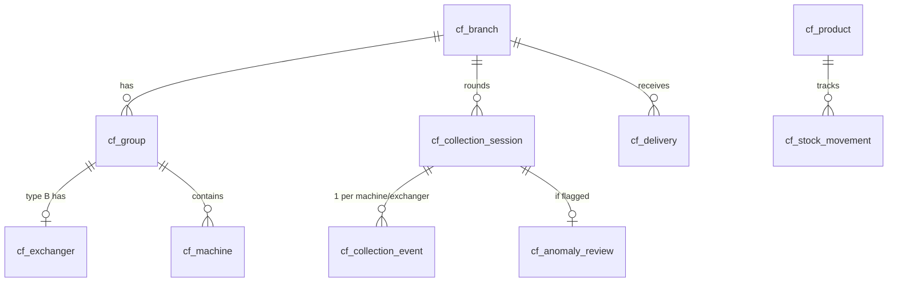

# Workshop · ClawFleet Unify (ระบบบริหารตู้คีบ — รวมเป็นทางเดียว)

> Generated by `/feature-workshop` (MEGA) on 2026-06-02
> Personas: PM · Senior Programmer · UX · Devil's Advocate (4, parallel)
> Status: **Approved** (CEO ตอบครบทุกข้อ + สั่งลงมือต่อด้วย /bigfeature → /auditbigteam → /bigsolvebug)
> Scope: ClawFleet only · Pool module · ข้อมูลปัจจุบันเป็นของปลอม **ลบทิ้งได้หมด** (greenfield freedom)

---

## 0. 🔑 บริบทที่เปลี่ยนเกมจาก workshop นี้

จากการ deep-research โค้ดจริง + ถาม CEO เจอความจริง 4 อย่างที่พลิกทิศ:

1. **ยังไม่มีใครใช้จริง · พนักงานยังใช้ Excel อยู่** → field adoption = 0 · ปัญหาจริงคือ "ทำให้พนักงานกรอกได้จริงแทน Excel" ไม่ใช่แค่แต่งเมนู
2. **ข้อมูลทิ้งได้หมด ไม่ซีเรียส** → ไม่ต้องห่วง migration/archive/back-compat · เลือกสถาปัตยกรรมที่ถูกที่สุดได้เลย
3. **ตู้แลกเหรียญต้องมีจริง** → โมเดลที่ deploy อยู่ (รายสาขาล้วน) **ตัดตู้แลกทิ้ง = ผิด** · ต้องมี cross-check 3 ทาง
4. **ต้นเหตุเมนูซ้อน** = `clawfleet/v2/layout.tsx` วาด `V2Shell` ที่มี sidebar ของตัวเอง ซ้อนกับ Pool `AdminShell` (lib/modules.ts) → 8 รายการซ้ำ

**ของที่มีอยู่แล้วใช้ต่อได้:** branch `claude/clawfleet-antifraud` (ยังไม่ push) มี (ก) exchanger 3-way cross-check (v2-group-data.ts) (ข) bank-settlement (settlement.ts) (ค) **แก้เมนูเหลือแถบเดียวแล้ว** (commit 1ca2ef5) — เป็นวัตถุดิบหลักของทิศทางที่ถูก

---

## 1. 🎯 Goal & Success Metrics

**เป้าหมายธุรกิจ:** หยุดพนักงานโกง (เงินขาด/ตุ๊กตาหาย/เหรียญหาย) ในร้านตู้คีบ ~100 ตู้ / 10 สาขา · ให้เจ้าของนั่งดูที่ออฟฟิศเห็นทุกสาขา real-time · แทน Excel

**Success metrics (CEO เลือก "ทุกข้อ"):**
- **M1 (core):** 1 รอบเก็บเงิน end-to-end ทำงานจริง — พนักงานมือถือกรอก 1 สาขา (ตู้แลก+ตู้คีบ ถ่ายรูป+เลขมิเตอร์) → office เห็นทันที → cross-check 3 ทางขึ้นธงถ้าไม่ตรง
- **M2 (scale):** รองรับครบ 10 สาขา ~100 ตู้ ใน 1 วันได้
- **M3 (clean):** เมนูไม่ซ้ำ · ทุกปุ่มกดแล้วไปหน้าที่ทำงานจริง (ไม่มี 404/หน้าเปล่า/demo หลอกตา)

**Definition of Done:** ครบ M1+M2+M3 + ผ่าน /auditbigteam + /bigsolvebug ไม่มี P0/P1 ค้าง

---

## 2. 👥 User Personas

- **เจ้าของ (Super Admin / patipan)** — นั่งออฟฟิศ เปิดเว็บเดสก์ท็อป · งานประจำวัน: ดูรายการต้องตรวจ (anomaly) → รายได้วันนี้ → สถานะเก็บเงินรายสาขา · ต้องการหลักฐาน (รูป+ตัวเลข) เวลามีข้อพิพาทกับพนักงาน
- **พนักงานเก็บเงิน (1 คน/สาขา)** — เดินเก็บในสาขาตัวเอง ด้วย**มือถือ (LINE)** · งานเดียว: เปิดรอบ → เดินเก็บทีละตู้ (ถ่ายรูป+กรอกเลข) → ปิดรอบ · ปัจจุบันใช้ Excel
- **ผู้จัดการสาขา/พื้นที่** (อนาคต) — รับ escalate เคสที่เจ้าของส่งต่อ

---

## 3. 🚶 User Journey

### 3A. พนักงาน (LINE Mini App — แทน Excel)
1. เปิด LINE → tab ตู้คีบ (LIFF) → เห็นสาขาที่ตัวเองรับผิดชอบ → กด "เริ่มรอบเก็บ"
2. **ถ้าเป็นกลุ่มตู้แลก (type B):** ไปตู้แลกก่อน → ถ่ายมิเตอร์เหรียญที่จ่าย + เงินสดในตู้แลก + 3 รูป
3. เดินเก็บตู้คีบทีละตู้ → ถ่ายมิเตอร์เหรียญปัจจุบัน (1 รูป, รอบก่อนระบบดึงให้) + มิเตอร์ตุ๊กตา + ตุ๊กตาก่อน/หลังเติม + เงินสดในถาด (type A) — 4-5 รูป/ตู้
4. กดปิดรอบ → ระบบ cross-check อัตโนมัติ → ผ่าน=CLOSED / ไม่ผ่าน=ANOMALY ส่งเจ้าของ

### 3B. เจ้าของ (เว็บออฟฟิศ — เมนูเดียว)
1. เปิดหน้าหลัก → เห็น "ตอนนี้ต้องทำ N อย่าง" (anomaly + session ค้าง + ของใกล้หมด) + รายได้วันนี้
2. กดเข้า Anomaly review → เห็นรูป 4-5 ใบ/ตู้ + ตัวเลข cross-check 3 ทาง → ตัดสิน อนุมัติ/ตรวจซ้ำ/ส่งต่อ
3. ดู Insights/รายงาน · จัดการสาขา/ตู้/สินค้า

---

## 4. ✅ Feature List (MoSCoW)

### Must-have (v1)
- **โมเดล 2 แบบ:** สาขา > กลุ่ม > ตู้ · กลุ่ม type A (เงินสด) / type B (ตู้แลก+token)
- **Cross-check 3 ทาง (type B):** Σ เหรียญตู้แลกจ่าย ↔ Σ token ตู้คีบรับ ↔ เงินสดตู้แลก (± 5%)
- **Cross-check 2 ทาง (type A):** มิเตอร์เหรียญ×ราคา ↔ เงินสด · มิเตอร์ตุ๊กตา ↔ นับจริง
- **LINE Mini App (LIFF)** ทางเข้าพนักงาน — เลือกสาขา → เก็บทีละตู้ → ปิดรอบ (+ เว็บ /collect fallback)
- **เมนูเดียว (เว็บออฟฟิศ)** — ลบ sidebar ซ้อน · รวมเอาข้อดีของทั้ง 2 เมนู
- **Anomaly review** — รูป + cross-check 3 ทาง + ตัดสินใจ (อนุมัติ/ตรวจซ้ำ/ส่งต่อ) + กันคนตรวจอนุมัติงานตัวเอง (F2 ที่ทำไปแล้ว)
- **5 photo evidence/ตู้** บังคับ
- **ลบของเก่าทิ้งหมด** (v1 routes + group code เก่าที่ตีกัน + mobile-preview นิ่ง)

### Should-have (v1 ถ้ามีเวลา)
- Bank-settlement (รับเงินเข้าบัญชี เทียบสลิป — มีบน branch antifraud แล้ว)
- Stock 2 ระดับ (คลังสาขา + ในตู้ + คลังกลางส่งของ)
- Insights/รายงาน + CSV export

### Could-have (v2)
- OCR อ่านมิเตอร์จากรูปอัตโนมัติ
- Vendor-billing (บิลค่าเช่าห้าง AI parse)
- LINE Rich Menu + push แจ้งเตือน

### Won't-have (v1 — out of scope ชัดเจน)
- หลาย currency · หลายประเทศ
- offline-first sync (พนักงานต้องมีเน็ตตอนกรอก)

---

## 5. 🗄 Data Model (unified)

- **cf_branch** — สาขา · 1 พนักงานประจำ · monthlyOverhead
- **cf_group** — กลุ่มในสาขา · `type` = CASH (A) | TOKEN (B) · type B มี exchanger
- **cf_exchanger** — ตู้แลกเหรียญ (type B เท่านั้น) · coinMeter · cashTray
- **cf_machine** — ตู้คีบ · groupId · `coinKind` = CASH | TOKEN · lastCoinMeter/lastDollMeter/lastDollStock (state ต่อเนื่อง)
- **cf_collection_session** — รอบเก็บระดับสาขา · openedBy/closedBy/reviewer · status · cross-check snapshot (expected/actual cash, token variance, prize variance)
- **cf_collection_event** — 1 แถว = 1 ตู้/ตู้แลก ในรอบ · meters + cash + stock + refill + 5 photo URLs + flags
- **cf_stock_movement / cf_delivery / cf_anomaly_review** — สต๊อก + ส่งของ + ผลรีวิว

**ลบทิ้ง:** schema/โค้ดเก่าที่ไม่เข้าโครงนี้ (ข้อมูลทิ้งได้)

---

## 6. 🔌 Integration Points

- **LINE LIFF** — พนักงาน login ผ่าน LINE · ต้อง LIFF ID + channel · (memory: ระวัง iOS webview cookie drop [[liff-magic-link-ios-webview-cookie-drop-2026-05-30]])
- **R2 (Cloudflare)** — เก็บรูปหลักฐาน 5 รูป/ตู้
- **Supabase** — Postgres + RLS (org_id) · trigger cross-check (ถ้าใช้) ต้อง branch+group scoped ([[clawfleet-audit-2026-05-31]] เตือน trigger เคยถูก un-trigger)
- **Auth** — staff (branch-scoped) vs admin (org) · userBranchIds()

---

## 7. 🚨 Edge Cases & Error Handling (top 10)

1. มิเตอร์ถอยหลัง → BLOCK (C2)
2. มิเตอร์นิ่งแต่มีเงิน → BLOCK (M5)
3. ตู้แจกตุ๊กตาแต่เหรียญไม่ขึ้น (ตู้แจกฟรี) → BLOCK (P4)
4. type B: เหรียญตู้แลกจ่าย ≠ token ตู้คีบรับ เกิน 5% → ANOMALY (เหรียญหายนอกตู้/แลกนอกระบบ)
5. รูปขาด > 1 ใบ → ห้ามส่ง
6. ปิดรอบทั้งที่กรอกไม่ครบทุกตู้ → ห้าม (completeness gate)
7. เน็ตหลุดกลางกรอก (มือถือ) → กันข้อมูลหาย (draft/retry)
8. คนตรวจ = คนเก็บ → ห้ามอนุมัติเอง (F2)
9. ขาด/เกินหักล้างกันข้ามตู้ → ตู้เดียวผิดก็ flag ทั้งรอบ (F5)
10. เงินขาดก้อนใหญ่แต่ <5% (สาขายอดสูง) → เพดาน ฿100 (F1)

---

## 8. ❓ Open Questions

- LIFF channel/ID — CEO ต้องสร้าง LINE Login + Messaging channel (หรือใช้ของ Pool ที่มี) → ผมจะ flag ตอน build
- เพดาน cross-check ตู้แลก (type B) — ใช้ 5% (GROUP_TOLERANCE_BPS) ตามเดิม · ปรับได้ภายหลัง
- Bank-settlement (Should-have) — ทำใน v1 หรือเลื่อน v2? (มีโค้ดบน branch antifraud แล้ว)

---

## 9. ⚠️ Risks (Top 5)

| Risk | Likelihood | Mitigation |
|---|---|---|
| 2 โมเดล (A/B) ทำให้ logic + UI ซับซ้อน คุมยาก | สูง | แยก type ชัดที่ schema (group.type) · UI สลับ flow ตาม type · reuse antifraud branch |
| LINE Mini App ทำไม่เสร็จ → พนักงานกลับไป Excel | สูง | ทำ /collect เว็บ-มือถือใช้ได้ก่อน เป็น fallback · LIFF ตามมา · ทดสอบกับพนักงานจริง 1 สาขา |
| ลบของเก่าหมดแล้วพังส่วนที่ลิงก์ถึง | กลาง | grep ทั้ง repo หา ref ก่อนลบ · /bigsolvebug จับ dead link |
| cross-check 3 ทางคำนวณผิด = จับโกงพลาด | สูง | /auditbigteam + adversarial verify logic เงินทุกเส้น |
| branch flip / parallel session ([[pooil-parallel-session-branch-switch]]) | กลาง | `git branch --show-current` ก่อน commit ทุกครั้ง · `cd` ทุก Bash |

---

## 10. 🚫 Out of Scope (Explicit v1)

- หลายบริษัท/หลาย currency · offline-first · OCR อัตโนมัติ · vendor-billing AI · LINE push/rich-menu (เลื่อน v2)

---

## 11. ➡️ Next Step — ลำดับการลงมือ (CEO สั่ง: ทำต่อทันที)

1. **`/bigfeature` ClawFleet unify** — สร้างของจริง: โมเดล A/B + cross-check 3 ทาง + เมนูเดียว + LINE Mini App + ลบของเก่า (เอา branch antifraud มาเป็นฐาน)
2. **`/auditbigteam` ClawFleet** — 12-persona ตรวจ spec + logic เงิน + IA หลัง build
3. **`/bigsolvebug` ClawFleet** — ไล่คลิกทุกปุ่ม/ทุก flow บน runtime จริง + แก้ P0/P1
4. Deploy + verify (build + curl) → CEO retest end-to-end

> เป้าหมายปลายทาง: "ใช้ได้จริงไม่มีปัญหา" (M1+M2+M3)
