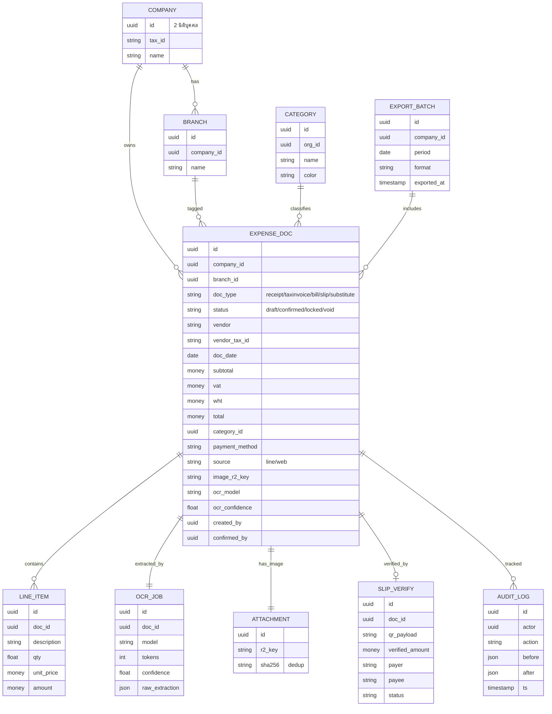

# Workshop · LedgerLine (โมดูลบัญชี JP Link)

> Generated by `/feature-workshop` on 2026-06-02
> Rounds: 1 (pivotal) + 1 (one-shot, 14 ข้อ) · Status: **Draft — รอ CEO sign-off**
> Personas: PM · Programmer · UX · Devil's Advocate
> Related: [[bainy-competitor-reference-2026-06-02]] · [[thai-receipt-ocr-research]] · [[jplink-uses-trcloud-2026-06-02]]

---

## 1. 🎯 Goal & Success Metrics

**เป้าหมายธุรกิจ:** ลดเวลา + ลดข้อผิดพลาดในการ "คีย์ค่าใช้จ่าย" ของ JP Link (2 บริษัท หลายสาขา) โดยให้พนักงานถ่ายสลิป/ใบเสร็จแล้ว AI อ่าน+แยกหมวดให้ → คนยืนยัน → ส่งต่อเข้า **TRCloud** (สมุดบัญชีหลักที่ยังใช้อยู่) ปัจจุบันพนักงานต้องนั่งคีย์เองเสียเวลามาก + พลาดเยอะมาก

**ตำแหน่งของระบบ:** **COMPLEMENT ไม่ใช่ REPLACE** — LedgerLine = "หน้าบ้านจับข้อมูล" ที่ป้อนเข้า TRCloud · TRCloud ยังเป็น book of record + ทำภาษี/งบ/auditor เหมือนเดิม (ตัดความเสี่ยง auditor/e-Tax/กฎภาษีทิ้งทั้งหมด)

**Success metrics (Phase 1):**
1. **เวลาคีย์ < 1 นาที/ใบ** (จากปัจจุบันที่ต้องนั่งคีย์มือทั้งหมด)
2. **ลดข้อผิดพลาดการคีย์** — วัดจากจำนวนรายการที่บัญชีต้องแก้ย้อนหลัง ลดลงอย่างมีนัยสำคัญ
3. **ค่าใช้จ่ายถูกแยกหมวด + ตรวจสอบย้อนได้** (มีรูปต้นฉบับแนบทุกใบ) เหมือน Bainy ฟรี

**Definition of Done (Phase 1):** พนักงานหน้างานถ่ายสลิปในกลุ่ม LINE → AI อ่าน → บัญชี 1 คนยืนยัน/แก้ → กด export เป็นไฟล์เข้า TRCloud ได้ · ครบ 2 บริษัท + แท็กสาขาได้ · มีรูปต้นฉบับทุกใบ

---

## 2. 👥 User Personas

- **พนักงานหน้างาน/สาขา (Staff)** — ถ่ายสลิป/ใบเสร็จในกลุ่ม LINE · ไม่อยากเรียนรู้อะไรเยอะ · ใช้มือถือ · งานหลัก = ถ่ายแล้วจบ
- **พนักงานหลังบ้าน (Back office)** — ทำรายการโอน/จ่าย · อยู่หน้าคอม · อยากแนบไฟล์ทีเดียวหลายใบผ่านเว็บ
- **พนักงานบัญชีในบริษัท (Accountant · 1 คน)** — ยืนยัน/แก้รายการ · ปิดงาน · export เข้า TRCloud · เป็นคนคุมความถูกต้อง
- **CEO** — ดู dashboard ภาพรวมค่าใช้จ่ายตามหมวด/สาขา/บริษัท (read-only)

---

## 3. 🚶 User Journey (2 โหมดตามแผนก)

**โหมด A · หน้างาน/สาขา (ผ่าน LINE):**
1. พนักงานถ่ายสลิป/ใบเสร็จส่งในกลุ่ม LINE ของสาขา
2. AI อ่าน → บอทเด้งการ์ด "ยืนยัน/แก้ไข" (ยอด · ร้าน · วันที่ · หมวด · สาขา) — ช่องที่ไม่มั่นใจไฮไลต์เตือน
3. พนักงานแตะแก้ตัวเลข/หมวดง่ายๆ ได้ในไลน์ → กดยืนยัน (ช่องภาษี/VAT ปล่อยให้บัญชีจัดการในเว็บ)
4. รายการเข้าคิว "รอบัญชีตรวจ"

**โหมด B · หลังบ้าน (ผ่านเว็บ):**
1. พนักงานหลังบ้านลากไฟล์/แนบรูปหลายใบทีเดียว (เช่น สลิปโอน) ในหน้าเว็บ
2. AI อ่านเป็นชุด → แสดงตารางให้ตรวจ

**โหมด C · บัญชีปิดงาน (เว็บ multi-pane):**
1. บัญชีเปิดตารางรายการทั้งเดือน (กรอง: รอตรวจ/ผิดปกติ/ครบ · ตามบริษัท/สาขา)
2. คลิกดูรายละเอียด+รูปในแพเนลขวา · แก้ช่องภาษี/VAT
3. เลือกหลายใบ → อนุมัติทีเดียว (lock)
4. กด **Export → ไฟล์เข้า TRCloud**

---

## 4. ✅ Feature List (MoSCoW)

### Must-have (Phase 1 launch)
- รับรูปจากกลุ่ม LINE (หน้างาน) + อัปโหลดหลายไฟล์ผ่านเว็บ (หลังบ้าน)
- AI อ่านใบเสร็จ → ดึง ยอด/ร้าน/วันที่/เลขผู้เสียภาษี/VAT/หมวด + **per-field confidence**
- โมเดล cheap→expensive cascade: **Claude Haiku → escalate Sonnet** (ผ่าน budget-guard เดิม + log token_usage)
- **สลิปโอนที่มี QR → เช็คกับธนาคาร (SlipOK/EasySlip)** ไม่ใช้ AI เดา
- **คนยืนยันก่อนบันทึกเสมอ — ห้าม auto-post** · validator คณิต (ยอดย่อย+VAT=ยอดรวม, เลขผู้เสียภาษี 13 หลัก, ไม่เดา VAT=7% ถ้าใบไม่มี)
- แยกหมวดค่าใช้จ่ายอัตโนมัติ + แก้หมวดได้
- **2 บริษัท + แท็กสาขา** (company_id + branch ทุกรายการ)
- ตารางรายการ multi-pane (กรองบริษัท/สาขา/หมวด/สถานะ) + รูปข้างขวา + bulk-approve
- **Export CSV/Excel เข้า TRCloud** (+ เผื่อ API ถ้า TRCloud มี)
- เก็บรูปต้นฉบับใน R2 ทุกใบ
- กันส่งซ้ำ (dedup รูป/เลขที่/เลขอ้างอิงสลิป)
- Roles + RLS: staff(ถ่าย) / accountant(ยืนยัน+export) / CEO(ดู) · แยกตามบริษัท
- รายการที่ยืนยันแล้ว: staff แก้ไม่ได้ · accountant แก้ได้แต่เก็บ audit log
- งบ AI cap ~2,000 บาท/เดือน

### Should-have (P1 ถ้ามีเวลา)
- Anti-fraud ขั้นสูง: เทียบยอด OCR=สลิป + ชื่อผู้รับตรง vendor → flag
- Dashboard ค่าใช้จ่ายตามหมวด/สาขา/เดือน (CEO view)
- งบรายหมวด + เตือนเกินงบ (แบบ Bainy)
- ใบแทนใบเสร็จ (substitute) — **บังคับแนบหลักฐานจ่าย + เหตุผล + อนุมัติ** ก่อนออก
- Flow "อ่านไม่ออก": เบลอ→ถ่ายใหม่ · ลายมือ→ถ่ายให้ชัด ไม่ได้→พิมพ์มือ

### Could-have (v2)
- ฝั่งรายรับ/ขาย (AR)
- เชื่อม TRCloud แบบ API อัตโนมัติ
- รายงานภาษี ภพ.30/ภงด export
- ถาม-ตอบในไลน์ ("สรุปค่าใช้จ่ายวันนี้") + voice-to-text
- เอกสาร PV/RV/JV/PCV PDF

### Won't-have (นอกขอบเขต — ป้องกัน scope creep)
- ❌ แทนที่ TRCloud / เป็น book of record
- ❌ ออกใบกำกับภาษี e-Tax / ยื่นภาษีเข้าสรรพากร (RD e-filing)
- ❌ งบการเงิน audit-grade / ปิดงบ
- ❌ สต็อก/inventory
- ❌ ระบบ "ตัดสิน" ภาษีเอง — ระบบแค่ "แนะนำ" · บัญชี/TRCloud ชี้ขาด (กันความรับผิดเรื่องกฎภาษีเปลี่ยน)

---

## 5. 🗄 Data Model



**หมายเหตุ schema สำคัญ:** ใส่ `company_id` + `branch_id` ในทุกตารางหลักตั้งแต่ migration แรก (แม้เริ่ม 2 บริษัท) — เพิ่มทีหลัง = rewrite. running number (ถ้ามี) scope ต่อ company × type × ปี ผ่าน RPC row-lock (บทเรียนเดียวกับ `repair_next_ticket_code`).

---

## 6. 🔌 Integration Points

- **LINE** — reuse omnichannel เดิม (HMAC verify, AES token, inbound webhook, flex confirm card, push reply) จาก Recruit/Inbox
- **Claude API** — Haiku→Sonnet cascade, tool-use JSON schema, ผ่าน budget-guard + token_usage (cloud OK; Claude ไม่เอาไปเทรน)
- **SlipOK / EasySlip** — verify QR สลิปโอนกับธนาคาร (~0.36฿/สลิป)
- **Cloudflare R2** — เก็บรูปต้นฉบับ + thumbnail (sha256 dedup)
- **TRCloud** — Phase 1 = export CSV/Excel ให้บัญชี import · ⚠️ ต้องเช็กฟอร์แมต import / API ของ TRCloud ก่อน (Open Q)
- **Supabase RLS** — แยกข้อมูลตาม org + company

---

## 7. 🚨 Edge Cases & Error Handling

1. ใบมีบรรทัด "VAT 7%" แต่ยอด = 0 → **ห้ามเดา VAT=70** (เจอในใบจริง JP Link แล้ว)
2. วันที่ในใบว่าง → บังคับให้คนใส่ ห้าม AI เดา
3. วิธีชำระไม่ติ๊ก → ให้คนเลือก
4. ลายมือ/เบลอ อ่านไม่ออก → เบลอ=ถ่ายใหม่ · ลายมือ=ถ่ายให้ชัด · ไม่ได้จริง=พิมพ์มือ
5. ส่งใบซ้ำ 2 รอบ → dedup (รูป hash + เลขที่ + เลขอ้างอิงสลิป)
6. รูปในกลุ่ม LINE ที่ไม่ใช่บิล (รูปคน/สินค้า) → filter + ปุ่ม "อันนี้ไม่ใช่บิล"
7. พนักงานหน้างานไม่มี account เว็บ (อยู่แต่ในไลน์) → map LINE identity → ใครถ่าย (audit)
8. แท็กผิดบริษัท/สาขา → default จากกลุ่ม LINE + ให้แก้ง่าย
9. ค่าใช้จ่ายจิปาถะไม่มีใบเสร็จ → ใบแทนใบเสร็จ (มี guardrail)
10. AI อ่านยอดผิดแบบเนียน → validator คณิต + คนยืนยัน + เก็บรูปไว้เทียบ

---

## 8. ❓ Open Questions

1. **TRCloud รับ import แบบไหน?** (CSV ฟอร์แมตไหน / มี API ไหม) — ต้องถาม TRCloud หรือดูในระบบ · กำหนดงาน export (Q4 = a+c)
2. **โมเดล OCR ตัวจริง** — research แนะนำ Haiku→Sonnet · CEO อยากรู้ว่า Bainy/Paypers ใช้อะไร = **หาไม่เจอข้อมูลสาธารณะ** (ทีมเล็กไม่เปิดเผย); ตัดสินด้วย accuracy spike กับใบจริงดีกว่าเดา
3. **รายชื่อสาขาจริงของ 2 บริษัท** — เอามาตั้งค่า branch
4. **หมวดค่าใช้จ่าย (chart of accounts)** — ใช้ชุดไหนให้ตรงกับ TRCloud (เพื่อ map ตอน export)
5. หน้าตรวจสิ้นเดือน (Q11) + onboarding พนักงาน (Q12) — ยังไม่เคาะ · ตั้ง best-guess: ตาราง multi-pane + บอทสอนผ่านใบแรก

---

## 9. ⚠️ Risks (Top 6)

| Risk | โอกาส | Mitigation |
|---|---|---|
| AI เดาตัวเลขเงินผิดแบบเนียน | สูง | ห้าม auto-post · validator คณิต · เก็บรูปต้นฉบับ · Claude hallucination ต่ำสุดบนเอกสารเงิน |
| Export ไม่เข้ากับ TRCloud → บัญชีต้องคีย์ซ้ำ 2 ที่ → เลิกใช้ | กลาง-สูง | เช็กฟอร์แมต TRCloud **ก่อนสร้าง** · ทำให้บัญชี import ได้ลื่น |
| แท็กบริษัท/สาขาผิด → หมวดเพี้ยน | กลาง | default จากกลุ่ม LINE/แผนก + แก้ง่าย |
| พนักงานส่งรูปขยะ/ไม่ใช่บิล ในกลุ่มที่คุยงานปนเยอะ | สูง | filter รูป + ปุ่ม "ไม่ใช่บิล" |
| โกง: เบิกซ้ำ/ยอดเป่า | กลาง | dedup + เทียบ OCR=สลิป + ชื่อผู้รับตรง vendor |
| PDPA: ข้อมูลการเงินออกนอกไทยไป Claude | ต่ำ-กลาง | Claude no-train + DPA · ถ้านโยบายเข้มขึ้นค่อยสลับ iApp/Typhoon |

---

## 10. 🚫 Out of Scope (ชัดเจน — กันเถียงทีหลัง)

แทนที่ TRCloud · ออกใบกำกับ e-Tax · ยื่นภาษีเข้าสรรพากร · งบการเงิน/ปิดงบ · สต็อก · ระบบตัดสินภาษีเอง · ฝั่งรายรับ/ขาย (เลื่อน v2)

---

## 11. ➡️ Next Step

1. **ทดสอบ OCR (Accuracy Spike 1 วัน)** — ดึงใบจริง ~50 ใบจาก TRCloud AP (พิมพ์ 30 + ลายมือ 20) → A/B/C/D เทียบ **4 โมเดล: Gemini 2.5 Flash-Lite · Gemini 2.5 Pro · Claude Haiku 4.5 · Claude Sonnet 4.6** → วัด field-level accuracy (เกณฑ์: พิมพ์ ≥95% / ลายมือ ≥85%) → เลือก "ตัวที่ถูกสุดที่ผ่านเกณฑ์"
   - **ต้นทุน/1,000 ใบ (research, fact-checked):** Gemini Flash-Lite ~7-18฿ (ถูกสุด) · Gemini Pro ~126฿ (เก่งลายมือไทยสุด 0.714) · Claude Haiku ~180-250฿ · Claude Sonnet ~400-750฿. ที่ volume JP Link (~1k/เดือน) ค่า AI ทุกตัว < 1,000฿/เดือน → **accuracy (ลายมือ) สำคัญกว่าราคา**
   - **Lean (รอ spike ยืนยัน):** Gemini Flash-Lite primary → escalate Gemini Pro สำหรับลายมือ (ถูกสุด + แม่นลายมือสุด); Claude = fallback. แลกกับการเพิ่ม Gemini เป็น vendor ที่ 2
2. เช็กฟอร์แมต import/API ของ TRCloud (Open Q #1)
3. `/plan` → แปลง spec เป็นแผน implement เฟส 1
```
