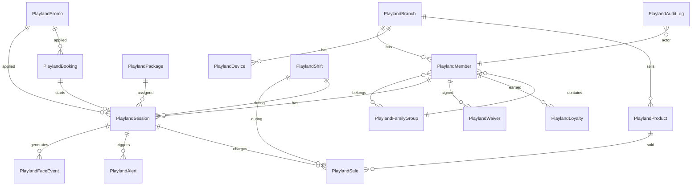

# Workshop · Playland

> Generated by `/feature-workshop` on 2026-05-25
> Workshop rounds: 2 (Round 1 = 4 questions · Round 2 = 22 questions)
> Status: **Draft — pending CEO approval**
> Next: `/plan` to convert to implementation plan

---

## 1. 🎯 Goal & Success Metrics

**เป้าหมายธุรกิจ**
ระบบบริหารร้าน Playland (โซนเครื่องเล่นเด็ก) ที่ใช้ face recognition (ACS-F606 + ACS302 gate) ควบคุมการเข้า-ออก คิดเวลาเล่นอัตโนมัติ + POS ขายขนม + จองล่วงหน้า + รายงานรายวัน · ทำเป็น module ใน Pool Command Center

**Definition of Done (v1)**
- เปิดสาขาแรกได้จริง · รับลูกค้า walk-in + จองล่วงหน้า · คิดเงินได้ไม่ผิด · ปิดยอดวันได้
- ทุก transaction (เข้า/ออก/ขายของ/จ่ายเงิน) มี audit log + ตรงกับยอด face scan
- Multi-branch ready · แต่เปิดจริง 1 สาขาก่อน

**Success Metrics (30 วันหลังเปิด)**
- รับเด็กได้ 50+ คน/วัน โดยไม่มี dispute เรื่องเวลา
- รายงานปิดยอดตรงกับเงินสดใน drawer ทุกวัน (zero discrepancy)
- Anti-fraud check: จำนวน face scan in/out = จำนวนใบเสร็จ = จำนวนคนใน CCTV
- เวลา check-in ครั้งแรก ≤ 3 นาที · ครั้งถัดไป ≤ 10 วินาที

---

## 2. 👥 User Personas

### Persona A · เด็ก (อายุ ~3-12 ปี)
- **บทบาท:** ลูกค้าหลักที่มาเล่น
- **เป้าหมาย:** เล่นเครื่องเล่นได้สนุก · ไม่อยากออก
- **Pain point:** เด็กไม่นิ่งตอนถ่ายรูป face register · เด็กเล็กแยกแยะหน้าได้ยาก (false positive)
- **Touch points:** สแกนหน้าเข้า · สแกนหน้าออก (กับผู้ปกครอง)

### Persona B · ผู้ปกครอง (อายุ 25-50)
- **บทบาท:** จ่ายเงิน · ดูแลความปลอดภัยลูก · อาจเล่นด้วยหรือนั่งรอ
- **เป้าหมาย:** มั่นใจว่าลูกปลอดภัย · เห็นเวลาเหลือ · จองล่วงหน้าได้
- **Pain point:** กลัวลูกหาย / คนแปลกหน้าพาออก · ไม่อยากเซ็นกระดาษเยอะ · อยากต่อเวลาง่ายตอนใกล้หมด
- **Touch points:** Register ที่เคาน์เตอร์ หรือ online ผ่าน web app/LINE · จ่ายเงิน Stripe/PromptPay · สแกนหน้าเข้า-ออก · ดู dashboard สมาชิก

### Persona C · พนักงานเคาน์เตอร์ (Cashier)
- **บทบาท:** Register สมาชิก · รับเงิน · ขายขนม · monitor session · confirm ขาออก · contact ผู้ปกครองตอนเวลาใกล้หมด
- **เป้าหมาย:** ทำงานเร็ว · ไม่ผิด · alert ตรวจสอบได้ทันใน peak hours
- **Pain point:** weekend คิวยาว · alert เด้งหลายอย่าง · ต้องสลับหน้า register/POS/monitor
- **Touch points:** Desktop PC + จอใหญ่ (เชื่อม face scanner + gate)

### Persona D · ผู้บริหาร / CEO
- **บทบาท:** ดูภาพรวมข้ามสาขา · ตรวจ anti-fraud · ตั้งค่าระบบ · จัดการ admin/staff
- **เป้าหมาย:** เห็นรายได้รวม · ปริ้นใบปิดวันได้ · เช็คว่าพนักงานไม่ทุจริต (face scan count = cash count)
- **Touch points:** Web app · cross-branch dashboard · audit log · settings

### Persona E · พี่เลี้ยง (Babysitter) — **NEW · Phase 2**
- **บทบาท:** จ้างเล่นกับเด็กเฉพาะ · คิดเงินรายชั่วโมง
- **เป้าหมาย:** รับงานจาก booking ของลูกค้า
- **Touch points:** มี face ลงทะเบียนเป็น staff type · payment ผ่าน POS หรือ pre-pay

---

## 3. 🚶 User Journey

### Journey 1 · ลูกค้าใหม่ Walk-in (เด็ก + ผู้ปกครอง 1 คน)
1. เดินเข้าร้าน → เคาน์เตอร์
2. พนักงานเปิดหน้า "ลงทะเบียนใหม่"
3. ถ่ายรูปหน้าเด็ก + กรอกชื่อ/อายุ/เบอร์ผู้ปกครอง
4. ถ่ายรูปหน้าผู้ปกครอง (1 คนขึ้นไป) · ผูกเป็น family group
5. เซ็น waiver บน tablet (consent + ความเสี่ยง)
6. เลือก package (Fixed / Pay-per-minute / Day pass)
7. ถ้าผู้ปกครองเข้าด้วย → เพิ่ม SKU "ค่าผู้ปกครอง" ตามที่ admin set ราคา
8. ชำระเงิน (Stripe / cash / future: PromptPay/Kbank/SCB)
9. ระบบ register face ทุกคนเข้า ACS-F606
10. ทุกคนสแกนหน้าเข้า · gate เปิด · session เริ่มจับเวลา
11. **ออก:** ทุกคนเดินมาที่เคาน์เตอร์ → สแกนหน้าออก → พนักงาน confirm pairing (เด็ก + ผู้ปกครองคนใดคนหนึ่งใน family group) → ปลดประตู

### Journey 2 · จองล่วงหน้า Online
1. ลูกค้าเปิด URL `/p/playland/[branch]/book` (หรือ LINE link)
2. เลือกสาขา · วันที่ · package
3. กรอกชื่อ + เบอร์
4. จ่าย Stripe (v1) → ได้ confirmation + QR booking code
5. ทางเลือก: register face ผ่านมือถือ (กล้องหน้าจอ · upload) **ก่อน**มาถึงร้าน
6. ถึงร้าน: scan QR booking → ถ้ายัง register face = ทำที่เคาน์เตอร์ · ถ้า register แล้ว = สแกนหน้าเข้าได้เลย

### Journey 3 · ขายขนม (Charge to member)
1. ผู้ปกครอง/เด็กเดินมาที่เคาน์เตอร์ POS
2. พนักงานสแกนหน้า → ระบบรู้ว่าใคร
3. พนักงานสแกน barcode สินค้า (หรือกดเลือกจาก grid)
4. ระบบโชว์ยอด · ตัวเลือก: charge เข้าบิล member (จ่ายตอนออก) หรือ จ่ายเงินสด/QR ทันที
5. Inventory stock ลด

### Journey 4 · ต่อเวลา (Time extension)
1. Session ของเด็กเหลือ < 10 นาที → ระบบเด้ง alert ใน cashier dashboard
2. พนักงานโทร/walk-up ไปบอกผู้ปกครอง
3. ผู้ปกครองตัดสินใจต่อ → พนักงาน select package เพิ่ม + รับเงิน
4. Session extended · ไม่ตัด · ไม่ออก

### Journey 5 · CEO ดู Cross-branch Report
1. CEO เปิด `/playland/reports` (admin role)
2. เห็น dashboard: รายได้รวม · per-branch breakdown · trending
3. คลิกสาขาใดสาขาหนึ่ง → drill down วันต่อวัน
4. คลิก "ใบปิดวัน" → ปริ้น PDF (รายได้ + จำนวนเด็ก + face scan count + cash count + variance)
5. ตรวจ audit log ถ้าสงสัย (ทุกการ refund/override/edit ของพนักงาน)

---

## 4. ✅ Feature List (MoSCoW)

### Must-have (v1 ship)
- M1 Pool module scaffolding (slug=playland · layout gate · view-header tabs)
- M2 Database schema + RLS (15 tables ตาม section 5)
- M3 Member registration with face capture (เด็ก + ผู้ปกครอง · family group · waiver บน tablet)
- M4 ACS-F606 adapter (REST API · register face · webhook receiver)
- M5 Session lifecycle (check-in · pause re-entry 15 min · check-out via counter manual confirm · expire)
- M6 Counter-controlled exit (cashier verifies pairing before unlock)
- M7 Package model (Fixed + Pay-per-minute + Day pass — ทั้ง 3 แบบ admin ตั้งค่า)
- M8 POS with barcode scan + inventory tracking + charge-to-member
- M9 Live Monitor (cashier dashboard + alert modal)
- M10 Online booking + Stripe payment (LINE link เป็น entry point)
- M11 Mobile face register (web app · ผู้ปกครองทำเองก่อนมา)
- M12 Promo system (coupon + loyalty points + birthday/weekday discount · ทุกประเภท admin toggle on/off)
- M13 Daily close (per-shift + end-of-day · manual button · drawer count)
- M14 Cross-branch dashboard (CEO view รวม + per-branch breakdown)
- M15 Audit log (ทุก action · 1 ปี + เงิน 7 ปี + device 90 วัน)
- M16 Anti-fraud cross-check (face scan count vs cash receipt count vs staff entry count)
- M17 Refund policy = ห้าม refund หลัง check-in (hard rule)
- M18 PDPA: parent consent form + retention 1 ปี inactive + ปุ่มลบ profile + privacy notice

### Should-have (v1 ถ้าทัน · ไม่ทัน v1.1)
- S1 Pre-register online (LINE OA + web form)
- S2 Member dashboard (parent view: เวลาเหลือ + ประวัติ + แต้ม + booking + day pass)
- S3 Time extension flow (alert ใกล้หมด → confirm + charge ต่อ inline)
- S4 Stranger face handler (face ไม่ผ่าน → adds new face พร้อม link existing identity + reason audit)
- S5 Multi-shift handover (cashier ปิดกะส่งต่อ + drawer count)
- S6 CCTV camera integration (verify face scan = actual person playing)

### Could-have (v2)
- C1 Babysitter service (พี่เลี้ยงรับจ้างเล่น · คิดรายชั่วโมง · ลูกค้าจองพี่เลี้ยงพร้อม booking)
- C2 SCB Easy Business / Kbank K-Connect free API (replace Stripe เมื่อพร้อม)
- C3 Birthday party booking (room reservation · package พิเศษ)
- C4 Age-based exit policy (เด็ก < X ปี ห้ามออกเอง · ระบบ block + alert)
- C5 Member transfer (โอนให้ญาติ · 1 ครั้ง/ปี · ตรวจหลักฐาน)
- C6 SMS/LINE notification (alert ผู้ปกครองตอนเวลาใกล้หมด)
- C7 People counting (per-branch occupancy real-time)
- C8 LINE OA chatbot (จองผ่าน chat · ดูสถานะ)

### Won't-have (Out of scope)
- ❌ Cash refund หลัง check-in (CEO ตัดสินใจ — hard policy)
- ❌ Max-time policy (CEO บอกไม่ซีเรียส ถ้าเวลายังไม่หมด)
- ❌ Mobile app native (web app responsive พอ)
- ❌ Loyalty redemption marketplace
- ❌ Franchise / SaaS multi-tenant (CEO ใช้เอง)

---

## 5. 🗄 Data Model

**Tables (15):**

| Table | Key fields | Notes |
|---|---|---|
| `playland_branches` | id, orgId, name, address, openingHours jsonb, settings jsonb | per-branch settings (parent fee, exit rules) |
| `playland_devices` | id, branchId, vendor, deviceId, baseUrl, secretEnc, status, lastSeenAt | ACS-F606 per branch · webhook secret encrypted |
| `playland_members` | id, branchId, type (kid/parent/staff/cleaner/vip/babysitter), name, phone, age, photoR2Path, faceId, consentAt, retentionUntil, deletedAt | PDPA-compliant retention |
| `playland_family_groups` | id, branchId, name, createdAt | logical grouping of members |
| `playland_family_members` | familyGroupId, memberId, role (primary_guardian/child/relative) | many-to-many |
| `playland_packages` | id, branchId, type (fixed/per_minute/day_pass), name, minutes (nullable), price, memberTypeAllowed enum[], active | 3 pricing models |
| `playland_sessions` | id, branchId, memberId, packageId, checkInAt, checkOutAt, pausedAt, totalPausedSecs, packageMinutes, minutesUsed, status (active/paused/expired/completed/forfeited), bookingId | session tracking |
| `playland_face_events` | id, branchId, deviceId, faceId, memberId (nullable), direction (in/out), confidence, snapshotR2Path, eventAt, webhookId UNIQUE, rawPayload jsonb | every ACS event · idempotent via webhookId |
| `playland_bookings` | id, branchId, memberId (nullable), guestName, guestPhone, packageId, slotStart, slotEnd, status (pending/paid/checkedin/canceled/expired), paymentRef, paymentMethod (stripe/promptpay/cash), qrCode, expiresAt | online booking |
| `playland_products` | id, branchId, name, barcode UNIQUE, price, stock, category, active | POS inventory |
| `playland_sales` | id, branchId, sessionId (nullable), items jsonb (line items), total, paymentMethod, cashierId, soldAt, shiftId | POS transactions |
| `playland_promos` | id, branchId, type (coupon/loyalty/birthday/weekday), code (nullable), discountType (percent/fixed), discountValue, conditions jsonb, active, startsAt, endsAt | promo engine |
| `playland_loyalty` | id, memberId, points, lastEarnedAt, expiresAt | points wallet |
| `playland_waivers` | id, memberId, signedAt, signatureR2Path (PDF), version | consent records |
| `playland_alerts` | id, branchId, sessionId, type (time_warning/time_expired/stranger/tailgate/mismatch), severity, message, resolvedAt, resolvedBy | monitor alerts |
| `playland_shifts` | id, branchId, cashierId, startedAt, endedAt, openingCash, closingCash, expectedCash, variance, status (open/closed) | per-shift cash drawer |
| `playland_audit_logs` | id, branchId, actorUserId, action, entityType, entityId, before jsonb, after jsonb, ip, at | every mutation logged |

**Critical rules:**
- ทุก table มี `orgId` + RLS policy `current_org_id()` (Pool standard per [[multi-tenant-rls]])
- รูปหน้าทั้งหมดไป R2 · DB เก็บแค่ path/metadata
- `playland_face_events.webhookId UNIQUE` = idempotency (ACS webhook อาจส่งซ้ำ)
- Refund = forbidden after check-in (constraint at app + DB-level CHECK)
- Retention: photos auto-delete หลัง member inactive 1 ปี (cron `playland_purge_inactive_photos`)

---

## 6. 🔌 Integration Points

| System | Purpose | Auth | Risk |
|---|---|---|---|
| **ACS-F606 + ACS302** | Face recognition gate · register/delete face · webhook events | HTTP (device→server) OR TCP (bidirectional) · NO HTTPS support · GB2312 encoding for voice/LCD prompts · response must be ≤1.5s · sample format `{"ActIndex":"0","AcsRes":"1","Time":"1"}` | **No TLS = data in plaintext on internet** · vendor support · need follow-up API doc for face register endpoint |
| **Stripe** | Online payment v1 | API key | 3-5% fee · CEO will migrate to Kbank/SCB free API when ready (v2) |
| **Kbank K-Connect / SCB Easy Business** | Future free-tier auto-confirm payment | OAuth + webhook | Setup KYB · 2-3 weeks integration |
| **LINE Messaging API + LIFF** | Booking entry point · notification | Channel access token | Need official LINE OA account |
| **Cloudflare R2** | Photo storage (members, snapshots, waiver PDFs) | S3-compatible keys | Existing Pool bucket reused |
| **CCTV camera (TBD vendor)** | Anti-fraud cross-check · verify scan-in person = playing person | RTSP/ONVIF + AI detection | Vendor + AI pipeline TBD |
| **PromptPay (manual confirm)** | Backup payment method · cashier verifies slip | None (manual) | Risk of slip-fraud |
| **Web Push / SMS gateway** | Notify parent of time-near-expire | Provider TBD | Cost per message |

**Rate limits / quotas:**
- Stripe: 100 req/sec (overkill for SME)
- LINE: 1000 msg/min for OA
- ACS device: TBD (in docs)
- Supabase: shared with Pool · monitor 500MB ceiling

---

## 7. 🚨 Edge Cases & Error Handling

| # | Scenario | Handler |
|---|---|---|
| 1 | ACS-F606 ล่ม / ไฟดับ | **Open question** · CEO ตอบเป็น "ระบบพี่เลี้ยง" (น่าจะคนละเรื่อง) · default: cashier manual mode + เพิ่ม UPS หากเป็นไปได้ |
| 2 | เน็ตที่สาขาหลุด | Cashier ใช้ tablet offline · sync เมื่อ online (Should-have) |
| 3 | Face มาตรงผิดคน (false positive) | CEO บอก "ไม่ซีเรียส entry · ซีเรียส exit" · ทำ exit confirmation manual โดยพนักงาน + เก็บ confidence score |
| 4 | Face ไม่ผ่าน (unknown face) | เพิ่มหน้าใหม่ · แต่ต้องระบุ link กับ identity เดิม + reason · audit log มา investigate ทุจริต |
| 5 | ผู้ปกครองคนละคนกับที่พาเข้ามารับ | ระบบเช็ค family group · ถ้าอยู่ในกลุ่มเดียวกัน = OK · นอกกลุ่ม = block + cashier override + audit |
| 6 | คนแปลกหน้าพาเด็กออก (kidnap risk) | ขาออกผ่านเคาน์เตอร์ · พนักงาน confirm pairing ก่อนปลดประตู (Round 1 lock) |
| 7 | Session expired แต่เด็กยังไม่ออก | Alert พนักงาน · พนักงานโทร/หาผู้ปกครอง · ต่อเวลาผ่าน UI หรือ check-out |
| 8 | Payment ค้าง 30 นาทีไม่ confirm | Booking auto-expire · cron `playland_expire_bookings` |
| 9 | ระบบจำหน้าเด็กผิดเป็นพี่น้องคล้ายกัน | Confidence score + snapshot · admin override + log |
| 10 | Cashier ขายของผิดราคา | Audit log + manager review · refund flow (เฉพาะ POS · ไม่ใช่ session) |
| 11 | Fire alarm / emergency | **Open question** · CEO ตอบ "ไม่มี" · default: ใส่ emergency unlock button ใน admin panel + แนะนำติดประตูฉุกเฉินแยกตาม กม. (consult วิศวกร) |
| 12 | Drawer cash ไม่ตรง end-of-shift | Variance logged · manager review next shift · pattern detection if recurring |
| 13 | Refund request หลัง check-in | Block at UI + DB · แสดง policy ชัดเจน · cashier override = audit log |
| 14 | Cross-fraud (face scan ≠ cash count ≠ CCTV) | Anti-fraud dashboard · alert CEO ถ้า variance > threshold · investigate manually |
| 15 | Stripe payment failed mid-booking | Booking stays pending · ลูกค้าจ่ายซ้ำได้ · auto-expire 30 นาที |

---

## 8. ❓ Open Questions

| # | Question | Why deferred | Who decides | When needed |
|---|---|---|---|---|
| ~~OQ1a~~ | ✅ **RESOLVED 2026-05-26** — Official protocol PDFs received via Drive · `pooilgroup-web/docs/acs/{acs-doc-1.pdf,acs-doc-2.pdf}` · using doc-2 HTTP LAN (port 8091 · UTF-8 · NOT GB2312) · all endpoints documented in `pooilgroup-web/docs/acs/README.md` | — | — | — |
| ~~OQ1b~~ | ✅ **RESOLVED 2026-05-25** — CEO เลือก **Version C** (mixed/offline-tolerant) · เหตุผล: "1 ปีหลุดก็รับได้ แต่ C ดีกว่า" · schema ต้องมี face sync table + background job push faces to device | — | — | — |
| OQ1c | **NEW** HTTPS not supported by device — face data + events in plaintext over internet · how to mitigate? | Security risk | CEO + tech | ก่อน open สาขาแรก (PDPA compliance) |
| OQ2 | Q15 hardware fallback (ACS พัง) — CEO ตอบเป็น "ระบบพี่เลี้ยง" ซึ่งเป็นคนละเรื่อง · ต้องถามใหม่ | คำตอบ ambiguous | CEO | ก่อน Phase 3 (session engine) |
| OQ3 | Q16 ประตูฉุกเฉิน "ไม่มี" หมายถึงไม่มีประตูแยก หรือยังไม่ได้คิด? | Legal compliance | CEO + วิศวกรอาคาร | ก่อน open สาขาแรก |
| OQ4 | กล้อง CCTV ใช้ยี่ห้อไหน · มี RTSP/ONVIF feed ไหม | ต้องเลือก camera แล้วค่อย design AI pipeline | CEO · vendor sourcing | Should-have S6 |
| OQ5 | อายุเด็กที่ห้ามออกเอง = กี่ปี | กฎความปลอดภัย | CEO + ทีม operations | Could-have C4 |
| OQ6 | LINE OA account ที่จะใช้ — มีแล้วหรือต้องสร้างใหม่ | Setup time | CEO | Phase 5 booking |
| OQ7 | Stripe account · มีพร้อมหรือยัง | KYB time | CEO | Phase 5 booking |
| OQ8 | "ระบบพี่เลี้ยง" (Persona E) — รายละเอียดเช่น คิดเงินยังไง · ใครจ้าง · เป็นพนักงานเรา หรือ marketplace | New feature ยังไม่ scope ชัด | CEO + ทีม | v2 (Could-have C1) |
| OQ9 | Babysitter รับ payment ยังไง · มี split กับร้านไหม | Same as OQ8 | CEO | v2 |
| OQ10 | Camera vendor + AI provider สำหรับ anti-fraud | Vendor TBD | CEO + tech research | Should-have S6 |
| OQ11 | SMS gateway สำหรับ notification (ThaiBulkSMS / SCB SMS / etc.) | Cost decision | CEO | Could-have C6 |
| OQ12 | Privacy policy / Terms of Service text (PDPA) | Legal review | กฎหมาย + CEO | ก่อน open สาขาแรก |

---

## 9. ⚠️ Risks (Top 5)

| # | Risk | Likelihood | Impact | Mitigation |
|---|---|---|---|---|
| R1 | **PDPA violation** — เก็บรูปหน้าเด็กไม่ถูกต้องตาม ม.26 | Med | **Catastrophic** (5M฿ + อาญา) | Parent consent form ลายเซ็น + retention 1 ปี + privacy notice ติดร้าน + breach response plan 72 ชม · เลื่อน launch ถ้ายังไม่พร้อม |
| R2 | **Child safety incident** (เด็กถูกพาออกผิดคน) | Low | **Catastrophic** (brand destruction + คดีอาญา) | Exit verification ผ่านเคาน์เตอร์ manual + family group pairing + CCTV cross-check (S6) + อายุ-based exit policy (C4) |
| R3 | **ACS device พัง / vendor support ช้า** | High | High (สาขาปิด · ขาดรายได้) | Cashier manual mode + spare device 1 ตัว/สาขา · negotiate SLA กับ vendor · ออกแบบ Pool ให้ทำงานต่อได้แม้ device ล่ม |
| R4 | **Supabase free tier ตัน** (500MB shared with Pool) | High | Med (ต้อง upgrade $25/mo) | รูปทั้งหมดไป R2 · event log archive 90 วัน · monitor DB size weekly · budget upgrade ถ้าโต > 300MB |
| R5 | **Anti-fraud พบทุจริตพนักงาน** (face scan ≠ cash) | Med | Med (loss + ต้องไล่ออก) | Cross-check dashboard + CEO weekly review · audit log immutable · auto-alert if variance > 3% |

---

## 10. 🚫 Out of Scope (Explicit · v1)

- ❌ Cash refund หลัง check-in (hard policy · CEO ลั่น)
- ❌ Max-time policy (ผู้ปกครองทิ้งเด็กนานแค่ไหนก็ได้ · ไม่ซีเรียส ถ้ายังไม่หมดเวลา)
- ❌ Mobile native app (web app responsive พอ)
- ❌ SaaS multi-tenant (CEO ใช้เอง · ใน 1 org)
- ❌ Loyalty redemption marketplace (มีแต่สะสมแต้ม v1 · redeem ภายหลัง)
- ❌ Franchise dashboard
- ❌ Self-checkout kiosk (ทุกอย่างผ่านเคาน์เตอร์ใน v1)
- ❌ POS integration กับ accounting (Pool มีระบบของตัวเอง · ส่งออก CSV)
- ❌ Automated refund processing (ทุก refund ต้อง manager approve)
- ❌ Tablet ใช้แทน Desktop ใน cashier (CEO เลือก Desktop PC + จอใหญ่ · เพราะต่อ scanner+gate)

---

## 11. ➡️ Next Step

**Recommended next action:**
1. CEO อ่าน spec นี้ → approve หรือ flag จุดที่อยากแก้
2. CEO ตอบ Open Questions OQ1, OQ2, OQ3 ที่ critical สำหรับ Phase 2-3
3. เปิด session ใหม่ → invoke `/plan` → produce implementation plan (น่าจะ 7 phases · ~18-22 dev-days เพราะ scope กว้างกว่า estimate เดิม จาก camera + barcode + 3 dashboards + babysitter)
4. CEO approve plan → start implementing Phase 0 (module scaffold)

**Estimated v1 timeline:**
- Phase 0-1 (foundation + schema): 2-3 days
- Phase 2 (ACS adapter): 2-3 days *blocked on OQ1 (docs)*
- Phase 3 (session engine): 2-3 days
- Phase 4 (cashier dashboard + register + POS): 4-5 days
- Phase 5 (booking + Stripe): 3-4 days
- Phase 6 (3 role dashboards + cross-branch): 3-4 days
- Phase 7 (audit + reports + close-shift): 2-3 days
- Polish + bug fix: 2-3 days
- **Total: 20-28 dev-days** (~5-7 working weeks)
